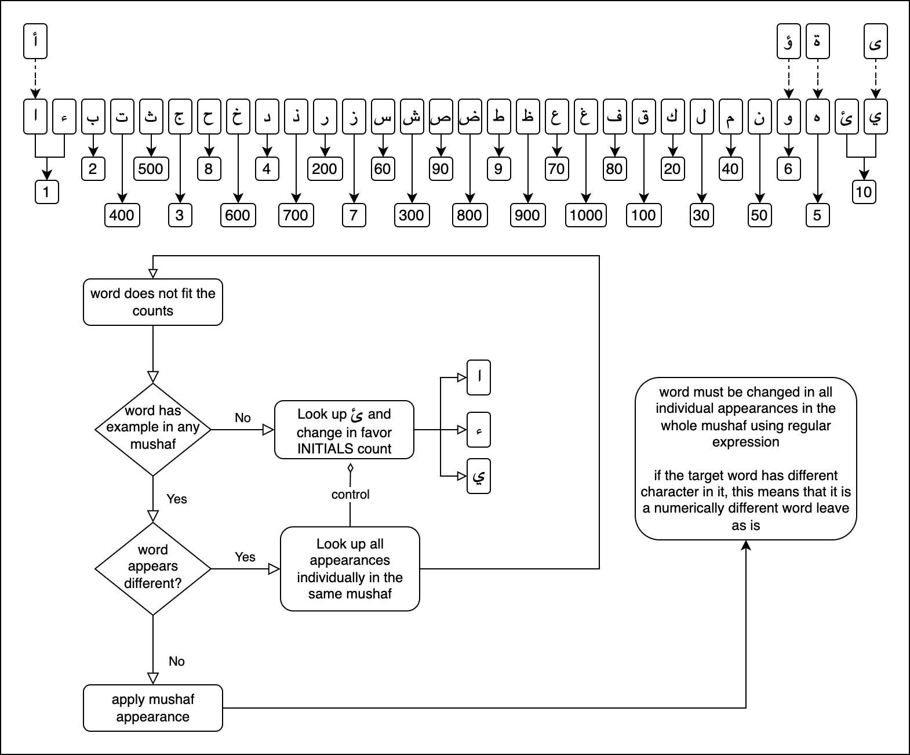

# PURPOSE
**In the name of GOD, Most Gracious, Most Merciful.**

An attempt to visualize the miracle of quran CODE 19. I hope GOD is with us.

# IN SEARCH OF THE CORRECT MUSHAF
By seeking refuge in GOD, we are striving to obtain a verifiable and accessible mushaf by examining all the mushafs on earth that we can access, using all the counts and evidence of GOD's Messenger of the Covenant. This effort is being advanced by updating verses with the unvowelled Arabic text obtained from an uthmani mushaf, utilizing the counting methodology hints found in the footnote of Quran The Final Testament 41:53 and in the Y.S. (YASEEN) paragraph in Appendix 1. May GOD be our helper; if GOD wills, our sole purpose is to serve GOD.

## METHODOLOGY



## PATH

We are going to follow the book QURAN: VISUAL PRESENTATION OF THE MIRACLE (Islamic Productions, 1982) in an order from start to end.

## STEPS

you can find the link to [STEPS](docs/STEPS.md) we have done so far

# AWARENESS
```
In the name of God, Most Gracious, Most Merciful

[43:1] H.M.

[43:2] And the enlightening scripture.

[43:3] We  have  rendered  it  an  Arabic  Quran, that you may understand.

[43:4] It  is  preserved  with  us  in  the  original master,  honorable  and  full  of  wisdom.
```
```
[13:39] GOD  erases  whatever  He  wills,  and fixes.  With  Him  is  the  original  Master Record.
```

```
A Great Prophecy*
[41:53] We  will  show  them  our  proofs  in  the horizons,  and  within  themselves, until  they  realize  that  this  is  the truth.*  Is  your  Lord  not  sufficient, as a witness of all things?

*41:53 The letters that compose this verse are 19, and their gematrical values add up to 1387, 19x73. This great prophecy, together with 9:33, 48:28, 61:9 & 110:2 inform us that the  whole  world  is  destined  to  accept  the  Quran  as  God’s  unaltered  message  (See Appendix 38).
```

### Y.S. (Ya Seen)
#### These two letters prefix Sura 36. The letter “Y” occurs in this sura 237 times, while the letter “S” (Seen) occurs 48 times. The total of both letters is 285, 19x15.

#### It is noteworthy that the letter “Y” is written in the Quran in two forms; one is obvious and the other is subtle. The subtle form of the letter may be confusing to those who are not thoroughly familiar with the Arabic language. A good example is the word “Araany ارينى ” which is mentioned twice in 12:36. The letter “Y” is used twice in this word, the first “Y” is subtle and the second is obvious. Sura 36 does not contain a single “Y” of the subtle type. This is a remarkable phenomenon, and one that does not normally occur in a long sura like Sura 36. In my book QURAN: VISUAL PRESENTATION OF THE MIRACLE (Islamic Productions, 1982) every “Y” and “S” in Sura 36 is marked with a star.