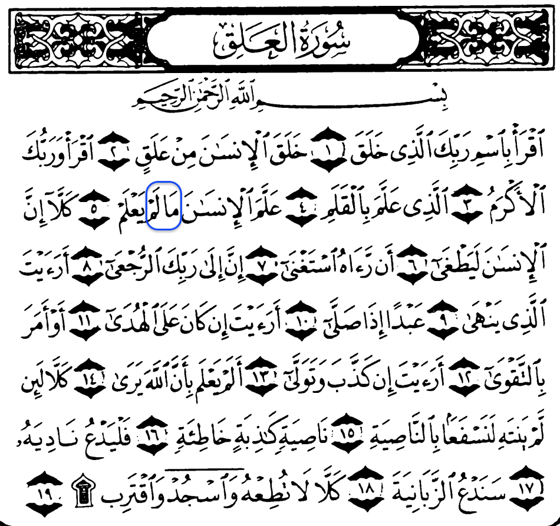
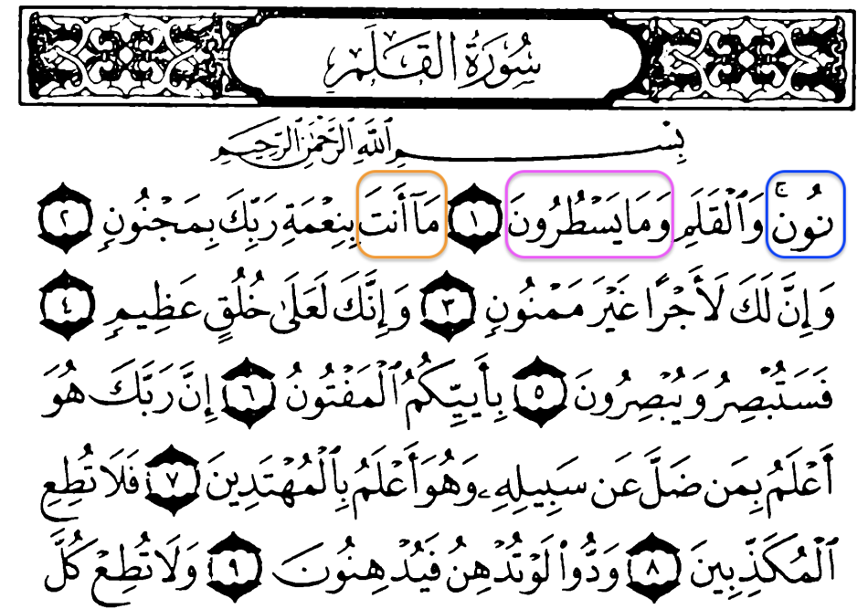
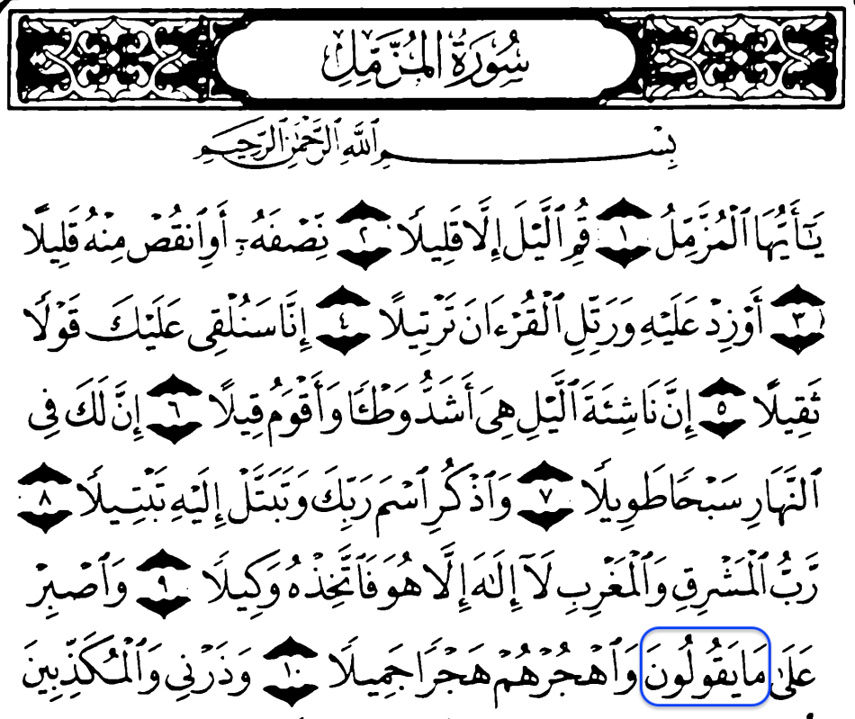
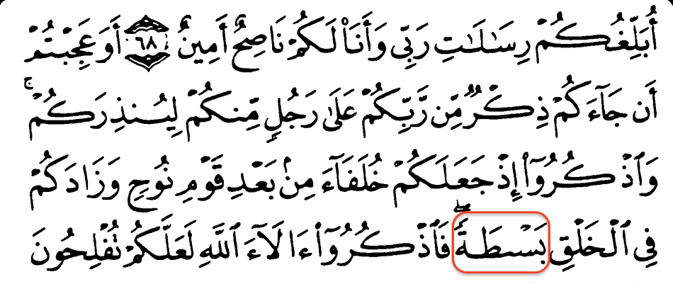
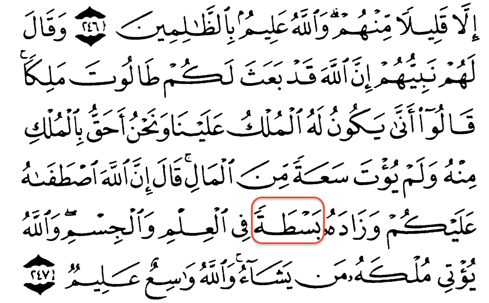
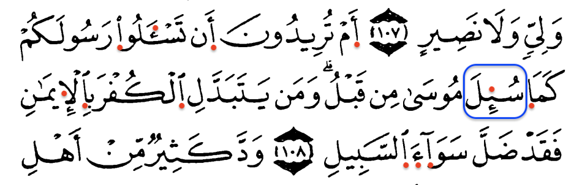
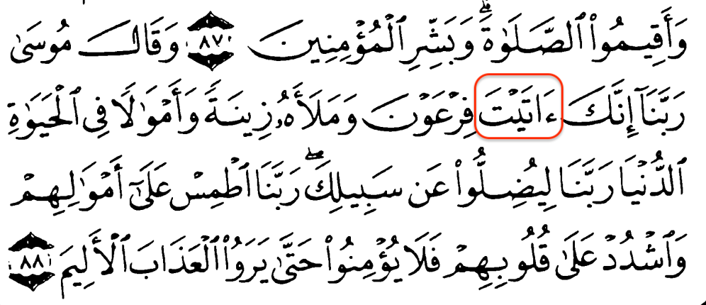
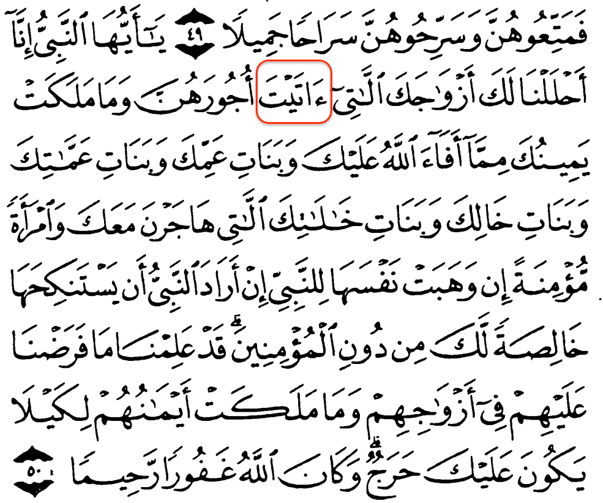

# [47:7] O you who believe, if you support GOD,  He  will  support  you,  and strengthen your foothold.

## “My  Lord,  I  seek  refuge  in  You from the whispers of the devils. And  I  seek  refuge  in  You,  my Lord, lest they come near me.”




0. MA-LEM
```
ما لم -> مالم
```
* 96:5

<>
* 2:151
* 2:236
* 2:239
* 3:151
* 4:113
* 5:20
* 6:6
* 6:81
* 6:91
* 7:33
* 18:68
* 18:78
* 18:82
* 19:43
* 22:71
* 23:68
* 39:47
* 42:21
* 48:27
---
---



1. NUN
```
ن -> نون
```
* 68:1
---

2. VEMA-YESTURUN
```
وما يسطرون -> ومايسطرون
```
* 68:1
---

3. MA-ENTE
```
ما انت -> ماانت
```
* 68:2

<>
* 20:72
* 26:154
---
---



4. MA-YAGULUN
```
ما يقولون -> مايقولون
```
* 73:10

<>
* 20:130
* 38:17
* 50:39
---
---




5. BASTAT
```
بصطة -> بسطة
```
* 7:69
---
---


6. ENBIYUNI
```
انبءونى -> انبئونى
```
* 2:31
---
---


7. VELSABIYYN, VELSABIYUN
```
والصبءين -> والصبئين
والصبءون -> والصبئون
```
* 2:62, 5:69

<>
* 22:17
---
---



8. SUIL, SUILU', SUILET
```
سئل -> سءل
سئلوا -> سءلوا
سئلت -> سءلت
```
* 2:108, 33:14, 81:8
---
---





9. ATEYT
```
اتيت -> ءاتيت
```
* 2:145
---
---