# [47:7] O you who believe, if you support GOD,  He  will  support  you,  and strengthen your foothold.

## “My  Lord,  I  seek  refuge  in  You from the whispers of the devils. And  I  seek  refuge  in  You,  my Lord, lest they come near me.”

0. NUN
```
ن -> نون
```
* 68:1
---
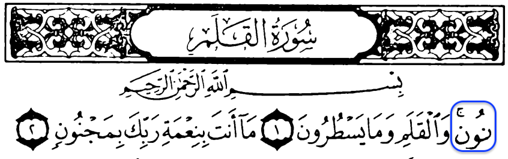

---
---

1. VELGUR-AN, BILGUR-AN, ELGUR-AN, LEGUR-AN, VEGUR-AN, GUR-AN, GUR-ANA, VEGUR-ANA, GUR-ANAHU, VEGUR-ANAHU, BIGUR-AN
```
والقران -> والقرءان
بالقران -> بالقرءان
القران -> القرءان
لقران -> لقرءان
وقران -> وقرءان
قران -> قرءان
قرانا -> قرءانا
وقرانا -> وقرءانا
قرانه -> قرءانه
وقرانه -> وقرءانه
بقران -> بقرءان
```
* 50:1, 13:31, 75:17

<>
* 2:185
* 4:82
* 5:101
* 6:19
* 7:204
* 9:111
* 10:15
* 10:37
* 10:61
* 12:2
* 12:3
* 15:1
* 15:87
* 15:91
* 16:98
* 17:9
* 17:41
* 17:45
* 17:46
* 17:60
* 17:78
* 17:82
* 17:88
* 17:89
* 17:106
* 18:54
* 20:2
* 20:113
* 20:114
* 25:30
* 25:32
* 27:1
* 27:6
* 27:76
* 27:92
* 28:85
* 30:58
* 34:31
* 36:2
* 36:69
* 38:1
* 39:27
* 39:28
* 41:3
* 41:26
* 41:44
* 42:7
* 43:3
* 43:31
* 46:29
* 47:24
* 50:45
* 54:17
* 54:22
* 54:32
* 54:40
* 55:2
* 56:77
* 59:21
* 72:1
* 73:4
* 73:20
* 75:18
* 76:23
* 84:21
* 85:21
---
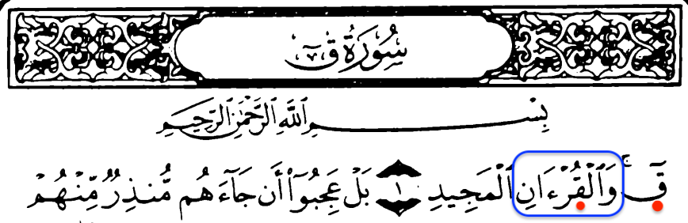

---
---

2. KITAB, LEKITAB, VEKITAB, BIKITAB, BIKITABIKUM, BIKITABY, KITABEH, KITABEHUM, KITABA, KITABEK, KITABEHA, KITABUNA, KITABIYEH
```
كتاب -> كتب
لكتاب -> لكتب
وكتاب -> وكتب
كتابه -> كتبه
بكتاب -> بكتب
بكتابكم -> بكتبكم
بكتابي -> بكتبي
كتابهم -> كتبهم
كتابا -> كتبا
كتابك -> كتبك
كتابها -> كتبها 
كتابنا -> كتبنا
كتابيه -> كتبيه
```
* 7:2, 84:10, 17:71, 52:2, 78:29, 46:4, 17:14, 27:28, 41:41, 37:157, 69:19, 45:28-29

<>
* 2:89
* 2:101
* 3:23
* 3:81
* 3:145
* 4:24
* 4:103
* 4:153
* 5:15
* 5:44
* 6:7
* 6:59
* 6:92
* 6:155
* 7:52
* 8:68
* 8:75
* 9:36
* 10:61
* 11:1
* 11:6
* 11:17
* 13:38
* 14:1
* 15:4
* 17:13
* 17:93
* 18:27
* 20:52
* 21:10
* 22:8
* 22:70
* 23:62
* 27:1
* 27:29
* 27:75
* 28:49
* 29:48
* 30:56
* 31:20
* 33:6
* 34:3
* 35:11
* 35:29
* 35:40
* 38:29
* 39:23
* 41:3
* 42:15
* 43:21
* 46:12
* 46:30
* 50:4
* 56:78
* 57:22
* 68:37
* 69:25
* 83:7
* 83:9
* 83:18
* 83:20
* 84:7
---
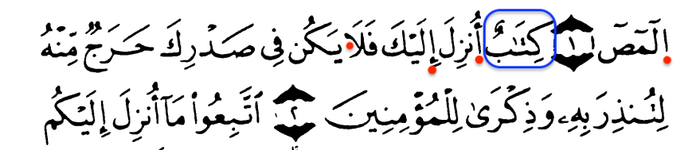

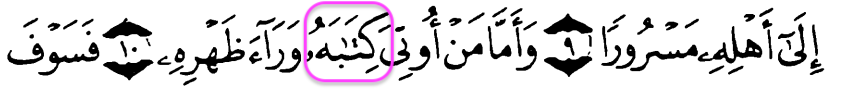
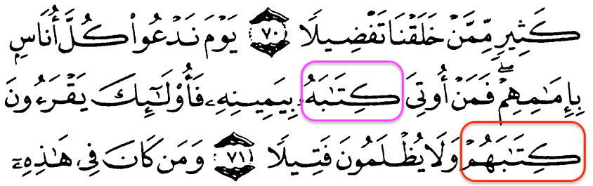
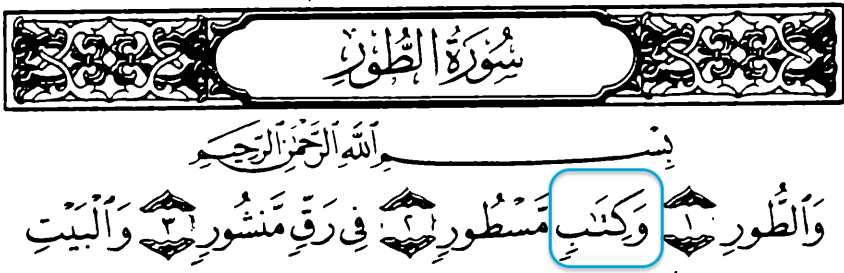
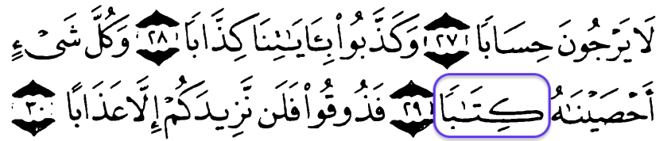
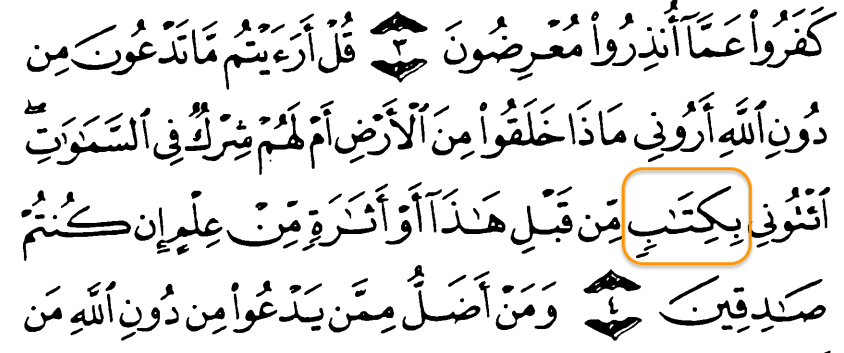
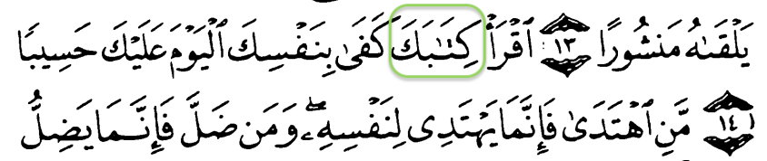
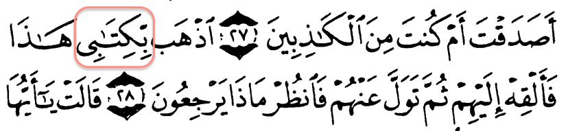
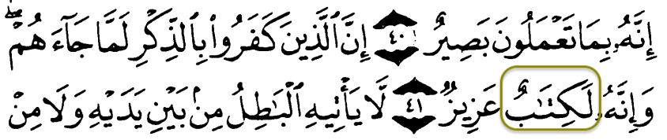
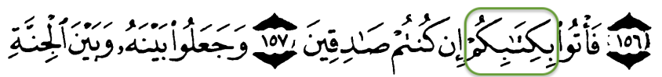
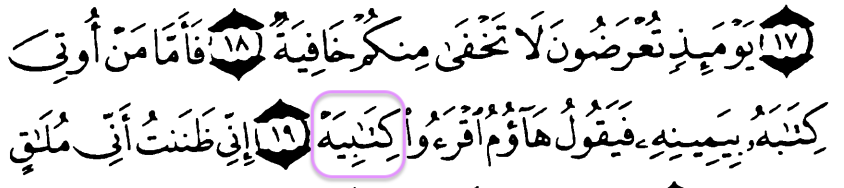
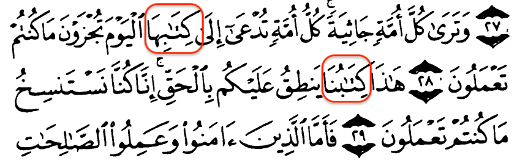

---
---

3. EHLEKNAHA
``` 
اهلكناها -> اهلكنها
```
* 7:4

<>
* 21:6
* 21:95
* 22:45
---
4. BEYATA
```
بياتا -> بيتا
```
* 7:4

<>
* 7:97
* 10:50
---
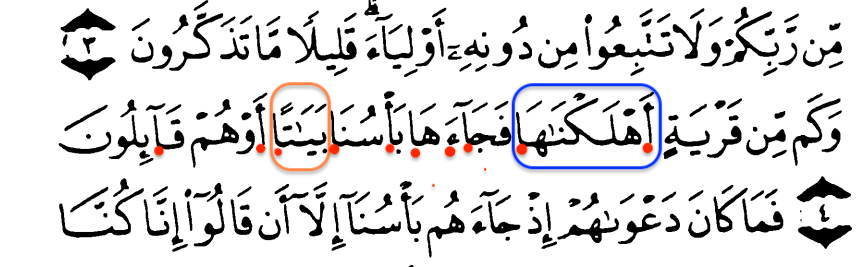

---
---

5. DAeVAEHUM
```
دعواهم -> دعوئهم
```
* 7:5

<>
* 10:10
* 21:15
---
6. ZALIMYN
```
ظالمين -> ظلمين
```
* 7:5

<>
* 7:148
* 8:54
* 21:14
* 21:46
* 21:97
* 26:209
* 29:31
* 68:29
---
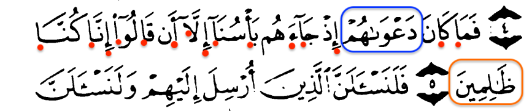

---
---

7. MEVAZIYNUHU
```
موازينه -> موزينه
```
* 7:8

<>
* 7:9
* 23:102
* 23:103
* 101:6
* 101:8
---
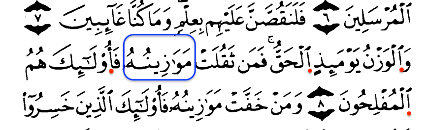

---
---

8. MEKKENNAKUM
```
مكناكم -> مكنكم
```
* 7:10

<>
* 46:26
---

9. MAAe'YShA
```
معايش -> معيش
```
* 7:10

<>
* 15:20
---
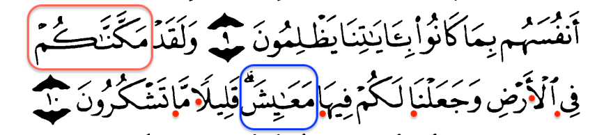

---
---

10. HgALAGNAKUM
```
خلقناكم -> خلقنكم
```
* 7:11

<>
* 6:94
* 18:48
* 20:55
* 22:5
* 23:115
* 49:13
* 56:57
---

11. SAVVARNAKUM
```
صورناكم -> صورنكم
```
* 7:11
---

12. LILMELAIKEH
```
للملائكه -> للملئكه
```
* 7:11

<>
* 2:30
* 2:34
* 15:28
* 17:61
* 18:50
* 20:116
* 34:40
* 38:71
---

13. LI-ADEME
```
لادم -> لءادم
```
* 7:11

<>
* 2:34
* 17:61
* 18:50
* 20:116
---

14. EL-SAJIDYN
```
الساجدين -> السجدين
```
* 7:11

<>
* 15:31
* 15:32
* 15:98
* 26:219
---
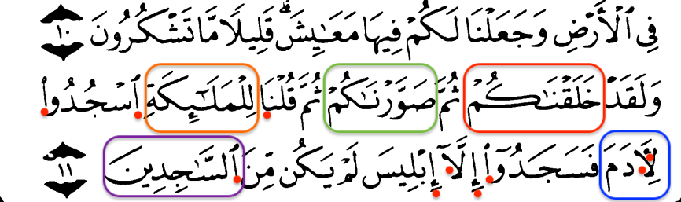

---
---

15. EL-SAGhIRYN
```
الصاغرين -> الصغرين
```
* 7:13

<>
* 12:32
---
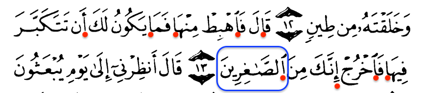

---
---

16. SIRATAKE
```
صراطك -> صرطك
```
* 7:16
---
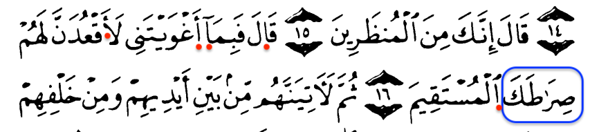

---
---

17. LEATIYENNEHUM
```
لاتينهم -> لءاتينهم
```
* 7:17
---

18. EYMANIHIM
```
ايمانهم -> ايمنهم
```
* 7:17

<>
* 3:86
* 3:90
* 5:53
* 5:108
* 6:82
* 6:109
* 9:12
* 9:13
* 16:38
* 16:71
* 23:6
* 24:53
* 32:29
* 33:50
* 35:42
* 40:85
* 48:4
* 58:16
* 63:2
* 70:30
---

19. ShAKIRYN
```
شاكرين -> شكرين
```
* 7:17
---
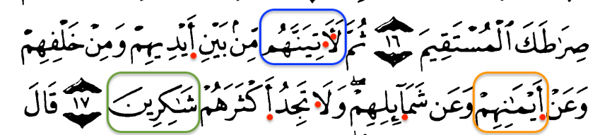

---
---

20. VEYA ADEM, YA ADEM
```
ويا ادم -> ويءادم
يا ادم -> يءادم
```
* 7:19, 20:120

<>
* 2:33
* 2:35
* 20:117
---

21. EL-ZALIMYN, BIL-ZALIMYN, VEL-ZALIMYN

```
الظالمين -> الظلمين
والظالمين -> والظلمين
بالظالمين -> بالظلمين
```
* 7:19, 62:7, 76:31

<>
* 2:35
* 2:95
* 2:124
* 2:145
* 2:193
* 2:246
* 2:258
* 3:57
* 3:86
* 3:140
* 3:151
* 5:29
* 5:51
* 5:107
* 6:33
* 6:52
* 6:58
* 6:68
* 6:129
* 6:144
* 7:41
* 7:44
* 7:47
* 7:150
* 9:19
* 9:47
* 9:109
* 10:39
* 10:85
* 10:106
* 11:18
* 11:31
* 11:44
* 11:83
* 12:75
* 14:13
* 14:22
* 14:27
* 17:82
* 19:72
* 21:29
* 21:59
* 21:87
* 22:53
* 23:28
* 23:41
* 23:94
* 26:10
* 28:21
* 28:25
* 28:40
* 28:50
* 40:52
* 42:21
* 42:22
* 42:40
* 42:44
* 42:45
* 43:76
* 45:19
* 46:10
* 59:17
* 61:7
* 62:5
* 66:11
* 71:24
* 71:28
---
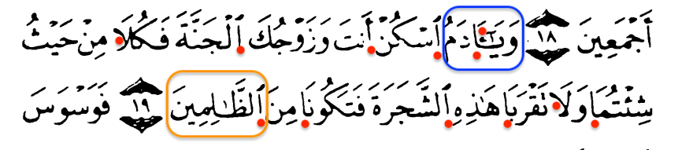

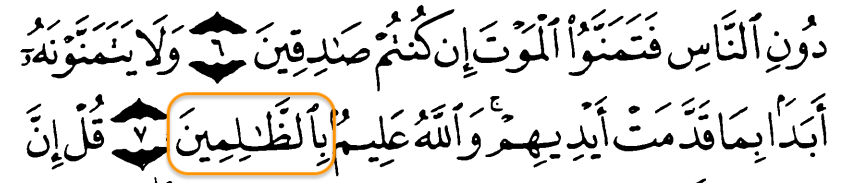
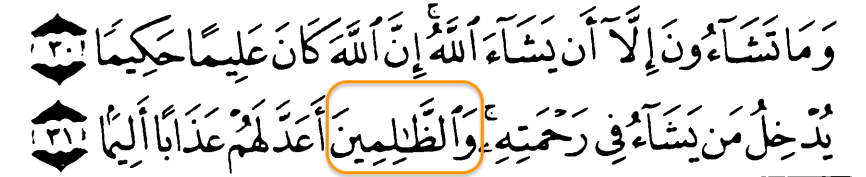
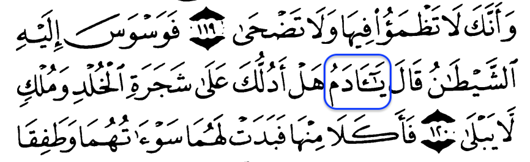

---
---

22. EL-ShEYTAN
```
الشيطان -> الشيطن
```
* 7:20

<>
* 2:36
* 2:168
* 2:208
* 2:268
* 2:275
* 3:36
* 3:155
* 3:175
* 4:38
* 4:60
* 4:76
* 4:83
* 4:119
* 4:120
* 5:90
* 5:91
* 6:43
* 6:68
* 6:142
* 7:22
* 7:27
* 7:175
* 7:200
* 7:201
* 8:11
* 8:48
* 12:5
* 12:42
* 12:100
* 14:22
* 16:63
* 16:98
* 17:27
* 17:53
* 17:64
* 18:63
* 19:44
* 20:120
* 22:52
* 22:53
* 24:21
* 25:29
* 27:24
* 28:15
* 29:38
* 31:21
* 35:6
* 36:60
* 38:41
* 41:36
* 43:62
* 47:25
* 58:10
* 58:19
* 59:16
---

23. VURIYE
```
ووري -> وري
```
* 7:20
---

24. SEV-ATIHIMA
```
سواتهما -> سوءتهما
```
* 7:20

<>
* 7:22
* 7:27
* 20:121
---

25. NEHAKUMA
```
نهاكما -> نهكما
```
* 7:20
---

26. ELHgALIDYN
```
الخالدين -> الخلدين
```
* 7:20
---
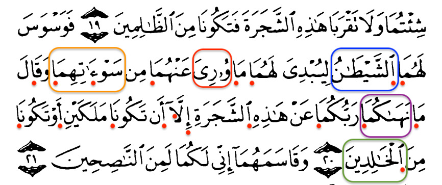

---
---

27. EL-NASIHYN
```
الناصحين -> النصحين
```
* 7:21

<>
* 7:79
* 28:20
---
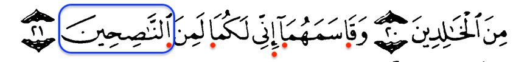

---
---

28. FEDALAHUMA
```
فدلاهما -> فدلهما
```
* 7:22
---

29. VE-NADEHUMA
```
وناداهما -> ونادئهما
```
* 7:22
---
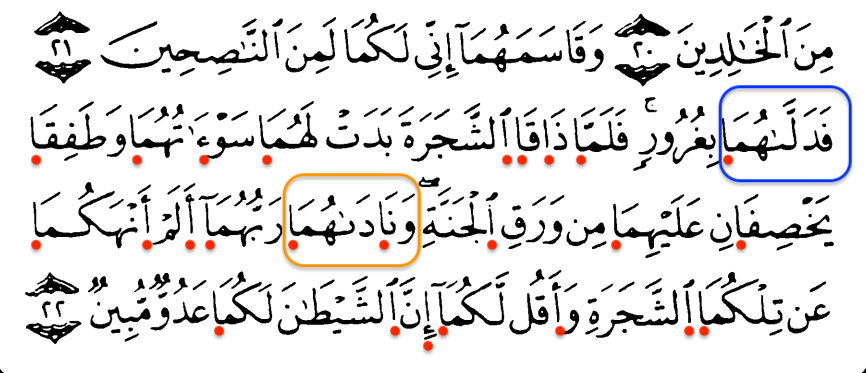

---
---

30. EL-HgASIRYN
```
الخاسرين -> الخسرين
```
* 7:23

<>
* 2:64
* 3:85
* 5:5
* 5:30
* 7:92
* 7:149
* 10:95
* 11:47
* 39:15
* 39:65
* 41:23
* 42:45
----
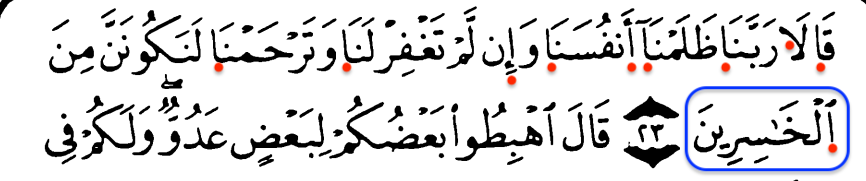

---
---

31. VE-METAU', FE-METAU', METAU'
```
ومتاع -> ومتع
فمتاع -> فمتع
متاع -> متع
```
* 7:24, 28:60, 57:20

<>
* 2:36
* 2:241
* 3:14
* 3:185
* 3:197
* 4:77
* 9:38
* 10:23
* 10:70
* 13:17
* 13:26
* 16:117
* 21:111
* 24:29
* 28:61
* 40:39
* 42:36
* 43:35
---
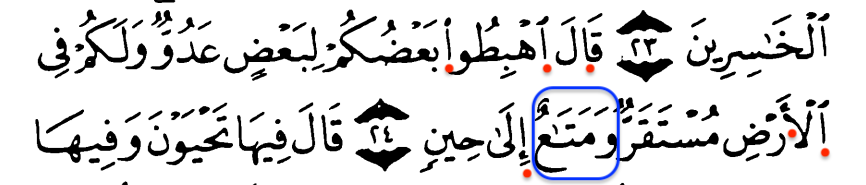

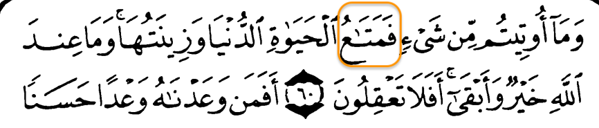
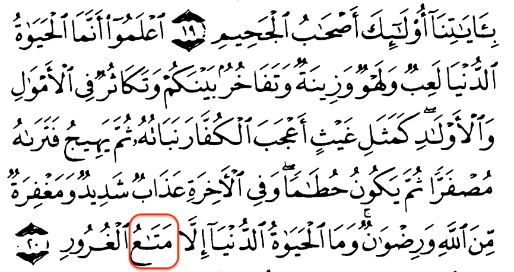

---
---

32. YA-BENY
```
يا بني -> يبني
```
* 7:26

<>
* 2:40
* 2:47
* 2:122
* 2:132
* 5:72
* 7:27
* 7:31
* 7:35
* 11:42
* 12:5
* 12:67
* 12:87
* 20:80
* 31:13
* 31:16
* 31:17
* 36:60
* 37:102
* 61:6
---

33. ADEME
```
ادم -> ءادم
```
* 7:26

<>

* 2:31
* 2:37
* 3:33
* 3:59
* 5:27
* 7:27
* 7:31
* 7:35
* 7:172
* 17:70
* 19:58
* 20:115
* 20:121
* 36:60
---

34. YUVA-RY
```
يواري -> يوري
```
* 7:26

<>
* 5:31
---

35. SEV-ATIKUM
```
سواتكم -> سوءتكم
```
* 7:26
---

36. AYATI
```
ايات -> ءايت
```
* 7:26

<>
* 2:99
* 2:231
* 2:252
* 3:7
* 3:97
* 3:101
* 3:108
* 3:113
* 4:140
* 6:4
* 6:158
* 7:133
* 10:1
* 12:1
* 12:7
* 13:1
* 15:1
* 17:101
* 18:17
* 19:58
* 22:16
* 24:1
* 24:34
* 24:46
* 26:2
* 27:1
* 27:12
* 28:2
* 28:87
* 29:49
* 29:50
* 31:2
* 33:34
* 36:46
* 39:71
* 40:4
* 40:35
* 40:56
* 40:69
* 40:81
* 45:4
* 45:5
* 45:6
* 45:8
* 45:35
* 51:20
* 53:18
* 57:9
* 58:5
* 65:11
---
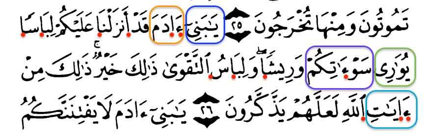

---
---

37. YERAKUM
```
يراكم -> يرئكم
```
* 7:27

<>
* 9:127
---

38. EL-ShEYATYN, VEL-ShEYATYN
```
الشياطين -> الشيطين
والشياطين -> والشيطين
```
* 7:27, 38:37

<>
* 2:102
* 6:71
* 6:121
* 7:30
* 17:27
* 19:68
* 19:83
* 21:82
* 23:97
* 26:210
* 26:221
* 37:65
---
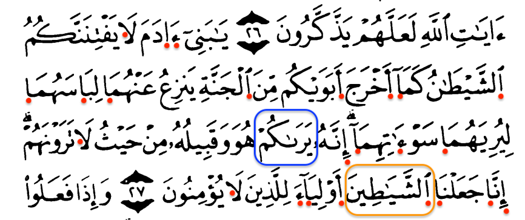

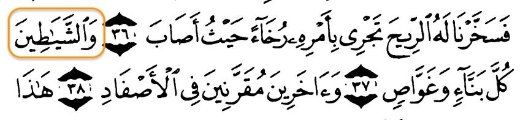

---
---

39. FAHIShAH, BIFAHIShAH
```
فاحشه -> فحشه
بفاحشه -> بفحشه
```
* 7:28, 33:30

<>
* 3:135
* 4:19
* 4:22
* 4:25
* 17:32
* 65:1
---

40. A-BA-ENA
```
اباءنا -> ءاباءنا
```
* 7:28

<>
* 2:170
* 5:104
* 7:95
* 10:78
* 21:53
* 26:74
* 31:21
* 43:22
* 43:23
---
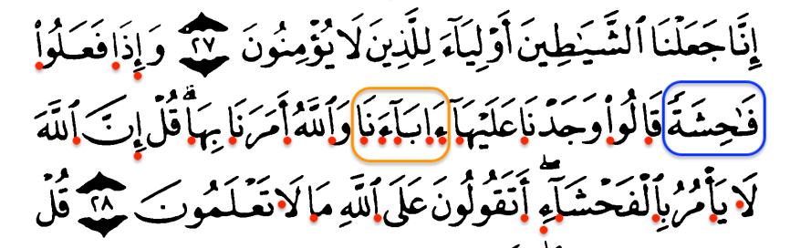

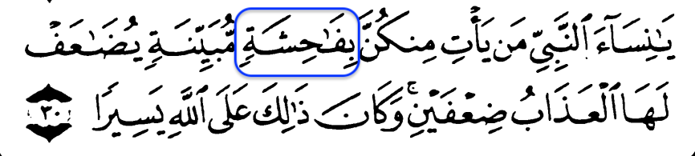

---
---

41. EL-DzALALEH
```
الضلاله -> الضلله
```

* 7:30

<>
* 2:16
* 2:175
* 4:44
* 16:36
* 19:75
---
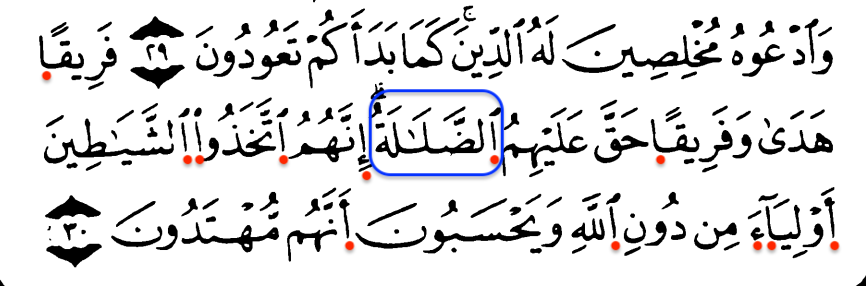

---
---

42. VEL-TAYYIBAT, LIL-TAYYIBAT
```
والطيبات -> والطيبت
للطيبات -> للطيبت
```
* 7:32, 24:26
---

43. A-MENU
```
امنوا -> ءامنوا
```
* 7:32

<>
* 2:9
* 2:13
* 2:14
* 2:25
* 2:26
* 2:62
* 2:76
* 2:82
* 2:91
* 2:103
* 2:104
* 2:137
* 2:153
* 2:165
* 2:172
* 2:178
* 2:183
* 2:208
* 2:212
* 2:213
* 2:214
* 2:218
* 2:249
* 2:254
* 2:257
* 2:264
* 2:267
* 2:277
* 2:278
* 2:282
* 3:57
* 3:68
* 3:72
* 3:100
* 3:102
* 3:118
* 3:130
* 3:140
* 3:141
* 3:149
* 3:156
* 3:193
* 3:200
* 4:19
* 4:29
* 4:39
* 4:43
* 4:47
* 4:51
* 4:57
* 4:59
* 4:60
* 4:71
* 4:76
* 4:94
* 4:122
* 4:135
* 4:136
* 4:137
* 4:144
* 4:152
* 4:173
* 4:175
* 5:1
* 5:2
* 5:6
* 5:8
* 5:9
* 5:11
* 5:35
* 5:51
* 5:53
* 5:54
* 5:55
* 5:56
* 5:57
* 5:65
* 5:69
* 5:82
* 5:87
* 5:90
* 5:93
* 5:94
* 5:95
* 5:101
* 5:105
* 5:106
* 5:111
* 6:82
* 7:42
* 7:87
* 7:88
* 7:96
* 7:157
* 8:12
* 8:15
* 8:20
* 8:24
* 8:27
* 8:29
* 8:45
* 8:72
* 8:74
* 8:75
* 9:20
* 9:23
* 9:28
* 9:34
* 9:38
* 9:61
* 9:86
* 9:88
* 9:113
* 9:119
* 9:123
* 9:124
* 10:2
* 10:4
* 10:9
* 10:63
* 10:98
* 10:103
* 11:23
* 11:29
* 11:58
* 11:66
* 11:94
* 12:57
* 13:28
* 13:29
* 13:31
* 14:23
* 14:27
* 14:31
* 16:99
* 16:102
* 17:107
* 18:13
* 18:30
* 18:107
* 19:73
* 19:96
* 22:14
* 22:17
* 22:23
* 22:38
* 22:50
* 22:54
* 22:56
* 22:77
* 24:19
* 24:21
* 24:27
* 24:55
* 24:58
* 24:62
* 26:227
* 27:53
* 29:7
* 29:9
* 29:11
* 29:12
* 29:52
* 29:56
* 29:58
* 30:15
* 30:45
* 31:8
* 32:19
* 33:9
* 33:41
* 33:49
* 33:53
* 33:56
* 33:69
* 33:70
* 34:4
* 35:7
* 36:47
* 38:24
* 38:28
* 39:10
* 40:7
* 40:25
* 40:35
* 40:51
* 40:58
* 41:8
* 41:18
* 41:44
* 42:18
* 42:22
* 42:23
* 42:26
* 42:36
* 42:45
* 43:69
* 45:14
* 45:21
* 45:30
* 46:11
* 47:2
* 47:3
* 47:7
* 47:11
* 47:12
* 47:20
* 47:33
* 48:29
* 49:1
* 49:2
* 49:6
* 49:11
* 49:12
* 49:15
* 52:21
* 57:7
* 57:13
* 57:16
* 57:19
* 57:21
* 57:27
* 57:28
* 58:9
* 58:10
* 58:11
* 58:12
* 59:10
* 59:18
* 60:1
* 60:10
* 60:13
* 61:2
* 61:10
* 61:14
* 62:9
* 63:3
* 63:9
* 64:14
* 65:10
* 65:11
* 66:6
* 66:8
* 66:11
* 74:31
* 83:29
* 83:34
* 84:25
* 85:11
* 90:17
* 95:6
* 98:7
* 103:3
---

44. EL-HAYA-H, BIL-HAYA-H, VEL-HAYA-H
```
الحياه -> الحيوه
بالحياه -> بالحيوه
والحياه -> والحيوه
```
* 7:32, 9:38, 67:2

<>
* 2:85
* 2:86
* 2:204
* 2:212
* 3:14
* 3:117
* 3:185
* 4:74
* 4:94
* 4:109
* 6:32
* 6:70
* 6:130
* 7:51
* 7:152
* 9:55
* 10:7
* 10:23
* 10:24
* 10:64
* 10:88
* 10:98
* 11:15
* 13:26
* 13:34
* 14:3
* 14:27
* 16:107
* 17:75
* 18:28
* 18:45
* 18:46
* 18:104
* 20:72
* 20:97
* 20:131
* 23:33
* 24:33
* 28:60
* 28:61
* 28:79
* 29:25
* 29:64
* 30:7
* 31:33
* 33:28
* 35:5
* 39:26
* 40:39
* 40:51
* 41:16
* 41:31
* 42:36
* 43:32
* 43:35
* 45:35
* 47:36
* 53:29
* 57:20
* 79:38
* 87:16
---

45. EL-GIYAMEH
```
القيامه -> القيمه
```

* 7:32

<>
* 2:85
* 2:113
* 2:174
* 2:212
* 3:55
* 3:77
* 3:161
* 3:180
* 3:185
* 3:194
* 4:87
* 4:109
* 4:141
* 4:159
* 5:14
* 5:36
* 5:64
* 6:12
* 7:167
* 7:172
* 10:60
* 10:93
* 11:60
* 11:98
* 11:99
* 16:25
* 16:27
* 16:92
* 16:124
* 17:13
* 17:58
* 17:62
* 17:97
* 18:105
* 19:95
* 20:100
* 20:101
* 20:124
* 21:47
* 22:9
* 22:17
* 22:69
* 23:16
* 25:69
* 28:41
* 28:42
* 28:61
* 28:71
* 28:72
* 29:13
* 29:25
* 32:25
* 35:14
* 39:15
* 39:24
* 39:31
* 39:47
* 39:60
* 39:67
* 41:40
* 42:45
* 45:17
* 45:26
* 46:5
* 58:7
* 60:3
* 68:39
* 75:1
* 75:6
---

46. EL-AYAT, BIL-AYAT
```
الايات -> الءايت
بالايات -> بالءايت
```
* 7:32, 17:59

<>
* 2:118
* 2:219
* 2:266
* 3:58
* 3:118
* 5:75
* 6:46
* 6:55
* 6:65
* 6:97
* 6:98
* 6:105
* 6:109
* 6:126
* 7:58
* 7:174
* 9:11
* 10:5
* 10:24
* 10:101
* 12:35
* 13:2
* 24:18
* 24:58
* 24:61
* 29:50
* 30:28
* 44:33
* 46:27
* 57:17
---
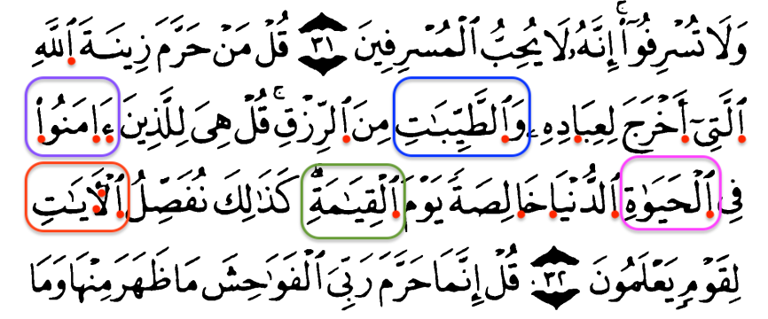

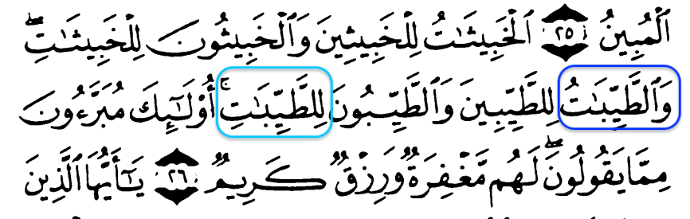
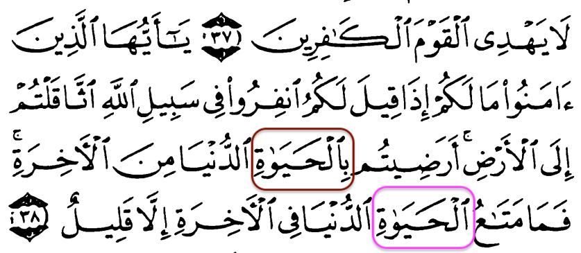
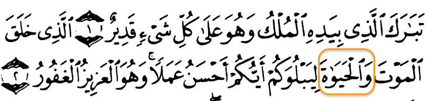
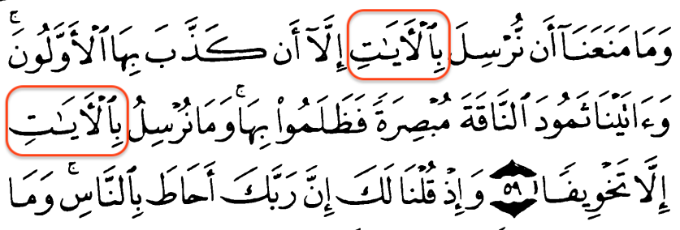

---
---

46. EL-FEVA-HISh, VEL-FEVA-HISh
```
الفواحش -> الفوحش
والفواحش -> والفوحش
```
* 7:33, 53:32

<>
* 6:151
* 42:37
---

47. SULTA-NA
```
سلطانا -> سلطنا
```
* 7:33

<>
* 3:151
* 4:91
* 4:144
* 4:153
* 6:81
* 17:33
* 17:80
* 22:71
* 28:35
* 30:35
---
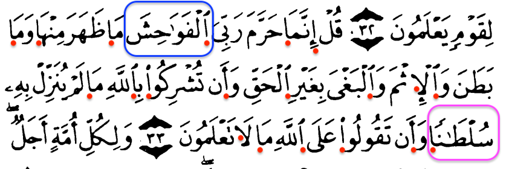

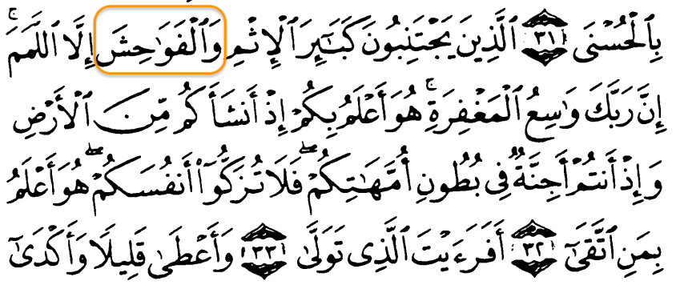

---
---

48. BIAYATINA
```
باياتنا -> بءايتنا
```
* 7:36

<>
* 2:39
* 3:11
* 4:56
* 5:10
* 5:86
* 6:39
* 6:49
* 6:54
* 6:150
* 7:9
* 7:40
* 7:51
* 7:64
* 7:72
* 7:103
* 7:136
* 7:146
* 7:147
* 7:156
* 7:176
* 7:177
* 7:182
* 10:73
* 10:75
* 11:96
* 14:5
* 17:98
* 19:77
* 21:77
* 22:57
* 23:45
* 25:36
* 26:15
* 27:81
* 27:82
* 27:83
* 28:35
* 28:36
* 29:47
* 29:49
* 30:16
* 30:53
* 31:32
* 32:15
* 32:24
* 40:23
* 41:15
* 41:28
* 43:46
* 43:47
* 43:69
* 54:42
* 57:19
* 64:10
* 78:28
* 90:19
---

49. ESHAB, VESHAB, FE-ESHAB, LI-ESHAB, BI-ESHAB, ESHABIHIM
```
اصحاب -> اصحب
واصحاب -> واصحب
فاصحاب -> فاصحب
لاصحاب -> لاصحب
باصحاب -> باصحب
اصحابهم -> اصحبهم
```
* 7:36, 56:8, 56:9, 56:38, 51:59

<>
* 2:39
* 2:81
* 2:82
* 2:119
* 2:217
* 2:257
* 2:275
* 3:116
* 4:47
* 5:10
* 5:29
* 5:86
* 6:71
* 7:42
* 7:44
* 7:46
* 7:47
* 7:48
* 7:50
* 9:70
* 9:113
* 10:26
* 10:27
* 11:23
* 13:5
* 15:78
* 15:80
* 18:9
* 20:135
* 22:44
* 22:51
* 25:24
* 25:38
* 26:61
* 26:176
* 29:15
* 35:6
* 36:13
* 36:55
* 38:13
* 39:8
* 40:6
* 40:43
* 46:14
* 46:16
* 50:12
* 50:14
* 56:27
* 56:41
* 56:90
* 56:91
* 57:19
* 58:17
* 59:20
* 60:13
* 64:10
* 67:10
* 67:11
* 68:17
* 74:31
* 74:39
* 85:4
* 90:18
* 90:19
* 105:1
---

50. HgALIDUN, EL-HgALIDUN
```
خالدون -> خلدون
الخالدون -> الخلدون
```
* 7:36, 21:34

<>
* 2:25
* 2:39
* 2:81
* 2:82
* 2:217
* 2:257
* 2:275
* 3:107
* 3:116
* 5:80
* 7:42
* 9:17
* 10:26
* 10:27
* 11:23
* 13:5
* 21:99
* 21:102
* 23:11
* 23:103
* 43:71
* 43:74
* 58:17
---
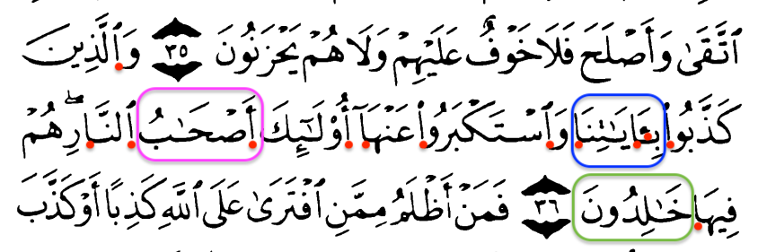

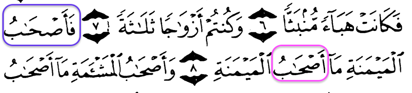
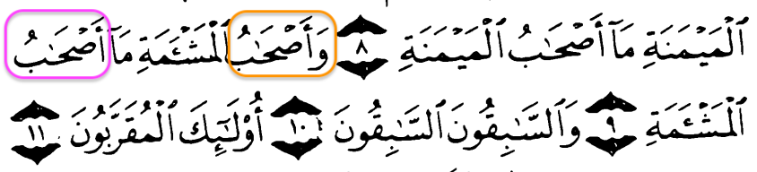
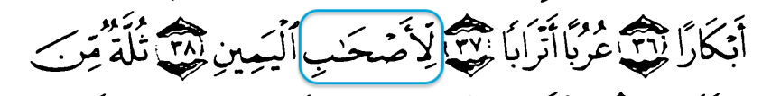


---
---

51. BIAYATIH
```
باياته -> بءايته
```
* 7:37

<>
* 6:21
* 6:118
* 10:17
---

52. EL-KTAB, VEL-KITAB, BIL-KITAB, VEBIL-KITAB
```
الكتاب -> الكتب
والكتاب -> والكتب
بالكتاب -> بالكتب
وبالكتاب -> وبالكتب
```
* 7:37, 4:136, 40:70, 35:25

<>
* 2:2
* 2:44
* 2:53
* 2:78
* 2:79
* 2:85
* 2:87
* 2:101
* 2:105
* 2:109
* 2:113
* 2:121
* 2:129
* 2:144
* 2:145
* 2:146
* 2:151
* 2:159
* 2:174
* 2:176
* 2:177
* 2:213
* 2:231
* 2:235
* 3:3
* 3:7
* 3:19
* 3:20
* 3:23
* 3:48
* 3:64
* 3:65
* 3:69
* 3:70
* 3:71
* 3:72
* 3:75
* 3:78
* 3:79
* 3:98
* 3:99
* 3:100
* 3:110
* 3:113
* 3:119
* 3:164
* 3:184
* 3:186
* 3:187
* 3:199
* 4:44
* 4:47
* 4:51
* 4:54
* 4:105
* 4:113
* 4:123
* 4:127
* 4:131
* 4:140
* 4:153
* 4:159
* 4:171
* 5:5
* 5:15
* 5:19
* 5:48
* 5:57
* 5:59
* 5:65
* 5:68
* 5:77
* 5:110
* 6:20
* 6:38
* 6:89
* 6:91
* 6:114
* 6:154
* 6:156
* 6:157
* 7:169
* 7:170
* 7:196
* 9:29
* 10:1
* 10:37
* 10:94
* 11:110
* 12:1
* 13:1
* 13:36
* 13:39
* 13:43
* 15:1
* 16:64
* 16:89
* 17:2
* 17:4
* 17:58
* 18:1
* 18:49
* 19:12
* 19:16
* 19:30
* 19:41
* 19:51
* 19:54
* 19:56
* 23:49
* 24:33
* 25:35
* 26:2
* 27:40
* 28:2
* 28:43
* 28:52
* 28:86
* 29:27
* 29:45
* 29:46
* 29:47
* 29:51
* 31:2
* 32:2
* 32:23
* 33:6
* 33:26
* 35:31
* 35:32
* 37:117
* 39:1
* 39:2
* 39:41
* 39:69
* 40:2
* 40:53
* 41:45
* 42:14
* 42:17
* 42:52
* 43:2
* 43:4
* 44:2
* 45:2
* 45:16
* 46:2
* 57:16
* 57:25
* 57:26
* 57:29
* 59:2
* 59:11
* 62:2
* 74:31
* 98:1
* 98:4
* 98:6
---

53. KAFIRYN
```
كافرين -> كفرين
```
* 7:37

<>
* 3:100
* 5:102
* 6:130
* 7:93
* 27:43
* 30:13
* 46:6
---


---
---

54. UHgRA-HUM
```
اخراهم -> اخرئهم
```
* 7:38
---

55. LIU-LAHUM
```
لاولاهم -> لاولهم
```
* 7:38
---

56. FEATIHIM
```
فاتهم -> فءاتهم
```
* 7:38
---


---
---

57. ULAHUM, ULAHUMA
```
اولاهم -> اولهم
اولاهما -> اولهما
```
* 7:39, 17:5
---

58. LIEHgRA-HUM
```
لاخراهم -> لاخرئهم
```
* 7:39
---


---
---

59. EBVAB, EL-EBVAB, EBVABA, EBVABUHA
```
ابواب -> ابوب
الابواب -> الابوب
ابوابا -> ابوبا
ابوابها -> ابوبها
```
* 7:40, 38:50, 78:19, 39:73

<>
* 2:189
* 6:44
* 12:23
* 12:67
* 15:44
* 16:29
* 39:71
* 39:72
* 40:76
* 43:34
* 54:11
---


---
---

60. EL-SALIHAT, FEL-SALIHAT
```
الصالحات -> الصلحت
فالصالحات -> فالصلحت
```
* 7:42, 4:34

<>
* 2:25
* 2:82
* 2:277
* 3:57
* 4:57
* 4:122
* 4:124
* 4:173
* 5:9
* 5:93
* 10:4
* 10:9
* 11:11
* 11:23
* 13:29
* 14:23
* 17:9
* 18:2
* 18:30
* 18:46
* 18:107
* 19:76
* 19:96
* 20:75
* 20:112
* 21:94
* 22:14
* 22:23
* 22:50
* 22:56
* 24:55
* 26:227
* 29:7
* 29:9
* 29:58
* 30:15
* 30:45
* 31:8
* 32:19
* 34:4
* 35:7
* 38:24
* 38:28
* 40:58
* 41:8
* 42:22
* 42:23
* 42:26
* 45:21
* 45:30
* 47:2
* 47:12
* 48:29
* 65:11
* 84:25
* 85:11
* 95:6
* 98:7
* 103:3
---


---
---

61. EL-ENHAR, ENHAR, VENHAR, ENHARA, VENHARA
```
الانهار -> الانهر
انهار -> انهر
وانهار -> وانهر
انهارا -> انهرا
وانهارا -> وانهرا
```
* 7:43, 47:15, 71:12, 16:15

<>
* 2:25
* 2:74
* 2:266
* 3:15
* 3:136
* 3:195
* 3:198
* 4:13
* 4:57
* 4:122
* 5:12
* 5:85
* 5:119
* 6:6
* 9:72
* 9:89
* 9:100
* 10:9
* 13:3
* 13:35
* 14:23
* 14:32
* 16:31
* 17:91
* 18:31
* 20:76
* 22:14
* 22:23
* 25:10
* 27:61
* 29:58
* 39:20
* 43:51
* 47:12
* 48:5
* 48:17
* 57:12
* 58:22
* 61:12
* 64:9
* 65:11
* 66:8
* 85:11
* 98:8
---

62. HADA-NA
```
هدانا -> هدئنا
```
* 7:43

<>
* 6:71
* 14:12
* 14:21
---


---
---

63. BISYMAHUM
```
بسيماهم -> بسيمهم
```
* 7:46

<>
* 2:273
* 7:48
* 47:30
* 55:41
---

64. SELAM, EL-SELAM, FESELAM, BISELAM, SELAMA, VESELAM, VESELAMA, VEL-SELAM
```
سلام -> سلم
السلام -> السلم
فسلام -> فسلم
بسلام -> بسلم
وسلام -> وسلم
سلاما -> سلما
وسلاما -> وسلما
والسلام -> والسلم
```
* 7:46, 59:23, 56:91, 50:34, 56:26, 37:181, 20:47

<>
* 4:94
* 5:16
* 6:54
* 6:127
* 10:10
* 10:25
* 11:48
* 11:69
* 13:24
* 14:23
* 15:46
* 15:52
* 16:32
* 11:69
* 19:15
* 19:33
* 19:47
* 19:62
* 21:69
* 25:63
* 25:75
* 27:59
* 28:55
* 33:44
* 36:58
* 37:79
* 37:109
* 37:120
* 37:130
* 39:73
* 43:89
* 51:25
* 97:5
---


---
---

65. EBSARUHUM, VE-EBSARUHUM, BI-EBSARIHIM
```
ابصارهم -> ابصرهم
وابصارهم -> وابصرهم
بابصارهم -> بابصرهم
```
* 7:47, 41:20, 68:51

<>
* 2:7
* 2:20
* 6:110
* 16:108
* 24:30
* 46:26
* 47:23
* 54:7
* 68:43
* 70:44
---


---
---

66. EL-KAFIRYN, VEL-KAFIRYN, BIL-KAFIRYN
```
الكافرين -> الكفرين
والكافرين -> والكفرين
بالكافرين -> بالكفرين
```
* 7:50, 4:140, 9:49

<>
* 2:19
* 2:34
* 2:89
* 2:191
* 2:250
* 2:264
* 2:286
* 3:28
* 3:32
* 3:141
* 3:147
* 4:101
* 4:139
* 4:144
* 5:54
* 5:67
* 5:68
* 7:101
* 8:7
* 8:18
* 9:2
* 9:26
* 9:37
* 10:86
* 11:42
* 13:14
* 13:35
* 16:27
* 16:107
* 19:83
* 25:26
* 25:52
* 26:19
* 29:54
* 30:45
* 33:1
* 33:48
* 33:64
* 35:39
* 36:70
* 38:74
* 39:59
* 39:71
* 40:25
* 40:50
* 40:74
* 47:11
* 67:28
* 69:50
* 71:26
* 74:10
* 86:17
---


---
---

67. NENSA-HUM
```
ننساهم -> ننسهم
```
* 7:51
---


---
---

68. JI'NA-HUM
```
جئناهم -> جئنهم
```
* 7:52
---

69. FESSALNA-HU
```
فصلناه -> فصلنه
```
* 7:52

<>
* 17:12
---


---
---

70. ELEYL, VE-LEYL, BI-LEYL, VEBI-LEYL
```
الليل -> اليل
والليل -> واليل
بالليل -> باليل
وبالليل -> وباليل
```
* 7:54, 93:2, 41:38, 37:138

<>
* 2:164
* 2:187
* 2:274
* 3:27
* 3:113
* 3:190
* 6:13
* 6:60
* 6:76
* 6:96
* 10:6
* 10:27
* 10:67
* 11:81
* 11:114
* 13:3
* 13:10
* 14:33
* 15:65
* 16:12
* 17:12
* 17:78
* 17:79
* 20:130
* 21:20
* 21:33
* 21:42
* 22:61
* 23:80
* 24:44
* 25:47
* 25:62
* 27:86
* 28:71
* 28:73
* 30:23
* 31:29
* 34:33
* 35:13
* 36:37
* 36:40
* 39:5
* 39:9
* 40:61
* 41:37
* 45:5
* 50:40
* 51:17
* 52:49
* 57:6
* 73:2
* 73:6
* 73:20
* 74:33
* 76:26
* 78:10
* 81:17
* 84:17
* 89:4
* 91:4
* 92:1
---

71. EL-SEMAVAT, VEL-SEMAVAT
```
السماوات -> السموت
والسماوات -> والسموت
```
* 7:54, 39:67

<>
* 2:33
* 2:107
* 2:116
* 2:117
* 2:164
* 2:255
* 2:284
* 3:29
* 3:83
* 3:109
* 3:129
* 3:133
* 3:180
* 3:189
* 3:190
* 3:191
* 4:126
* 4:131
* 4:132
* 4:170
* 4:171
* 5:17
* 5:18
* 5:40
* 5:97
* 5:120
* 6:1
* 6:3
* 6:12
* 6:14
* 6:73
* 6:75
* 6:79
* 6:101
* 7:158
* 7:185
* 7:187
* 9:36
* 9:116
* 10:3
* 10:6
* 10:18
* 10:55
* 10:66
* 10:68
* 10:101
* 11:7
* 11:107
* 11:108
* 11:123
* 12:101
* 12:105
* 13:2
* 13:15
* 13:16
* 14:2
* 14:10
* 14:19
* 14:32
* 14:48
* 15:85
* 16:3
* 16:49
* 16:52
* 16:73
* 16:77
* 17:44
* 17:55
* 17:99
* 17:102
* 18:14
* 18:26
* 18:51
* 19:65
* 19:90
* 19:93
* 20:4
* 20:6
* 21:19
* 21:30
* 21:56
* 22:18
* 22:64
* 23:71
* 23:86
* 24:35
* 24:41
* 24:42
* 24:64
* 25:2
* 25:6
* 25:59
* 26:24
* 27:25
* 27:60
* 27:65
* 27:87
* 29:44
* 29:52
* 29:61
* 30:8
* 30:18
* 30:22
* 30:26
* 30:27
* 31:10
* 31:16
* 31:20
* 31:25
* 31:26
* 32:4
* 33:72
* 34:1
* 34:3
* 34:22
* 34:24
* 35:1
* 35:38
* 35:40
* 35:41
* 35:44
* 36:81
* 37:5
* 38:10
* 38:66
* 39:5
* 39:38
* 39:44
* 39:46
* 39:63
* 39:68
* 40:37
* 40:57
* 42:4
* 42:5
* 42:11
* 42:12
* 42:29
* 42:49
* 42:53
* 43:9
* 43:82
* 43:85
* 44:7
* 44:38
* 45:3
* 45:13
* 45:22
* 45:27
* 45:36
* 45:37
* 46:3
* 46:4
* 46:33
* 48:4
* 48:7
* 48:14
* 49:16
* 49:18
* 50:38
* 52:36
* 53:26
* 53:31
* 55:29
* 55:33
* 57:1
* 57:2
* 57:4
* 57:5
* 57:10
* 58:7
* 59:1
* 59:24
* 61:1
* 62:1
* 63:7
* 64:1
* 64:3
* 64:4
* 78:37
* 85:9
---

72. MUSAHgARAT
```
مسخرات -> مسخرت
```
* 7:54

<>
* 16:12
* 16:79
---

73. EL-AeLEMYN
```
العالمين -> العلمين
```
* 7:54

<>
* 1:2
* 2:47
* 2:122
* 2:131
* 2:251
* 3:33
* 3:42
* 3:97
* 5:20
* 5:28
* 5:115
* 6:45
* 6:71
* 6:86
* 6:162
* 7:61
* 7:67
* 7:80
* 7:104
* 7:121
* 7:140
* 10:10
* 10:37
* 15:70
* 26:16
* 26:23
* 26:47
* 26:77
* 26:98
* 26:109
* 26:127
* 26:145
* 26:164
* 26:165
* 26:180
* 26:192
* 27:8
* 27:44
* 28:30
* 29:6
* 29:10
* 29:28
* 32:2
* 37:79
* 37:87
* 37:182
* 39:75
* 40:64
* 40:65
* 40:66
* 41:9
* 43:46
* 44:32
* 45:16
* 45:36
* 56:80
* 59:16
* 69:43
* 81:29
* 83:6
---


---
---

74. ISLAHIHA
```
اصلاحها -> اصلحها
```
* 7:56

<>
* 7:85
---


---
---

75. ER-RIYAH
```
الرياح -> الريح
```
* 7:57

<>
* 2:164
* 15:22
* 18:45
* 25:48
* 27:63
* 30:46
* 30:48
* 35:9
* 45:5
---

76. SUGNAHU, FESUGNAHU
```
سقناه -> سقنه
فسقناه -> فسقنه
```
* 7:57, 35:9
---

77. EL-SEMERAT
```
الثمرات -> الثمرت
```
* 7:57

<>
* 2:22
* 2:126
* 2:266
* 7:130
* 13:3
* 14:32
* 14:37
* 16:11
* 16:69
* 47:15
---


---
---

78. YA GAVMI, VEYA GAVMI, YA GAVMENA
```
يا قوم -> يقوم
ويا قوم -> ويقوم
يا قومنا -> يقومنا
```
* 7:59, 40:41, 46:31

<>
* 2:54
* 5:20
* 5:21
* 6:78
* 6:135
* 7:61
* 7:65
* 7:67
* 7:73
* 7:79
* 7:85
* 7:93
* 10:71
* 10:84
* 11:28
* 11:29
* 11:30
* 11:50
* 11:51
* 11:52
* 11:61
* 11:63
* 11:64
* 11:78
* 11:84
* 11:85
* 11:88
* 11:89
* 11:92
* 11:93
* 20:86
* 20:90
* 23:23
* 27:46
* 29:36
* 36:20
* 39:39
* 40:29
* 40:30
* 40:32
* 40:38
* 40:39
* 43:51
* 46:30
* 61:5
* 71:2
---


---
---

79. LENERA-KE
```
لنراك -> لنرئك
```
* 7:60

<>
* 7:66
* 11:91
---

80. DzALAL, DzALALA, EL-DzALAL, VEL-DzALAL, DzALALETIHIM, DzALALEH, DzALALEK
```
ضلال -> ضلل
ضلالا -> ضللا
الضلال -> الضلل
والضلال -> والضلل
ضلالتهم -> ضللتهم
ضلاله -> ضلله
ضلالك -> ضللك
```
* 7:60, 71:24, 22:12, 34:8, 27:81, 7:61

<>
* 3:164
* 4:60
* 4:116
* 4:136
* 4:167
* 6:74
* 10:32
* 12:8
* 12:30
* 12:95
* 13:14
* 14:3
* 14:18
* 19:38
* 21:54
* 26:97
* 28:85
* 30:53
* 31:11
* 33:36
* 34:24
* 36:24
* 36:47
* 39:22
* 40:25
* 40:50
* 42:18
* 43:40
* 46:32
* 50:27
* 54:24
* 54:47
* 62:2
* 67:9
* 67:29
---


---
---

81. RISALAT, VERISALATIH
```
رسالات -> رسلت
ورسالاته -> ورسلته
```
* 7:62, 72:23

<>
* 7:68
* 7:93
* 33:39
* 72:28
---


---
---

82. FE-ENJEYNAH, FE-ENJEYNAHUM
```
فانجيناه -> فانجينه
فانجيناهم -> فانجينهم
```
* 7:64, 21:9

<>
* 7:72
* 7:83
* 26:119
* 27:57
* 29:15
---


---
---

83. EL-KAZIBYN, KAZIBYN
```
الكاذبين -> الكذبين
كاذبين -> كذبين
```
* 7:66, 16:39

<>
* 3:61
* 9:43
* 11:27
* 12:26
* 12:74
* 24:7
* 24:8
* 26:186
* 27:27
* 28:38
* 29:3
---


---
---

84. A-LA-E
```
الاء -> ءالاء
```
* 7:69

<>
* 7:74
* 53:55
* 55:13
* 55:16
* 55:18
* 55:21
* 55:23
* 55:25
* 55:28
* 55:30
* 55:32
* 55:34
* 55:36
* 55:38
* 55:40
* 55:42
* 55:45
* 55:47
* 55:49
* 55:51
* 55:53
* 55:55
* 55:57
* 55:59
* 55:61
* 55:63
* 55:65
* 55:67
* 55:69
* 55:71
* 55:73
* 55:75
* 55:77
---


---
---

85. A-TUJA-DILUNENY
```
اتجادلونني -> اتجدلونني
```
* 7:71
---

86. VE-ABAUKUM, ABAUKUM
```
واباوكم -> وءاباوكم
اباوكم -> ءاباوكم
```
* 7:71, 34:43

<>
* 4:11
* 4:22
* 6:91
* 9:24
* 12:40
* 21:54
* 26:76
* 53:23
---

87. SULTAN, VESULTAN, BISULTAN, SULTANYEH, SULTANUH
```
سلطان -> سلطن
وسلطان -> وسلطن
بسلطان -> بسلطن
سلطانيه -> سلطنيه
سلطانه -> سلطنه
```
* 7:71, 40:23, 55:33, 69:29, 16:100

<>
* 10:68
* 11:96
* 12:40
* 14:10
* 14:11
* 14:22
* 15:42
* 16:99
* 17:65
* 18:15
* 23:45
* 27:21
* 34:21
* 37:30
* 37:156
* 40:35
* 40:56
* 44:19
* 51:38
* 52:38
* 53:23
---


---
---

88. SALIHA
```
صالحا -> صلحا
```
* 7:73

<>
* 2:62
* 5:69
* 7:75
* 7:189
* 7:190
* 9:102
* 11:61
* 11:66
* 16:97
* 18:82
* 18:88
* 18:110
* 19:60
* 20:82
* 23:51
* 23:100
* 25:70
* 25:71
* 27:19
* 27:45
* 28:67
* 28:80
* 30:44
* 32:12
* 33:31
* 34:11
* 34:37
* 35:37
* 40:40
* 41:33
* 41:46
* 45:15
* 46:15
* 64:9
* 65:11
---

89. YA AYYUHA, YA AYYUH
```
يا ايها -> يايها
يا ايه -> يايه
```
* 109:1, 43:49

<>
* 2:21
* 2:104
* 2:153
* 2:168
* 2:172
* 2:178
* 2:183
* 2:208
* 2:254
* 2:264
* 2:267
* 2:278
* 2:282
* 3:100
* 3:102
* 3:118
* 3:130
* 3:149
* 3:156
* 3:200
* 4:1
* 4:19
* 4:29
* 4:43
* 4:47
* 4:59
* 4:71
* 4:94
* 4:135
* 4:136
* 4:144
* 4:170
* 4:174
* 5:1
* 5:2
* 5:6
* 5:8
* 5:11
* 5:35
* 5:41
* 5:51
* 5:54
* 5:57
* 5:67
* 5:87
* 5:90
* 5:94
* 5:95
* 5:101
* 5:105
* 5:106
* 7:158
* 8:15
* 8:20
* 8:24
* 8:27
* 8:29
* 8:45
* 8:64
* 8:65
* 8:70
* 9:23
* 9:28
* 9:34
* 9:38
* 9:73
* 9:119
* 9:123
* 10:23
* 10:57
* 10:104
* 10:108
* 12:43
* 12:78
* 12:88
* 15:6
* 22:1
* 22:5
* 22:49
* 22:73
* 22:77
* 23:51
* 24:21
* 24:27
* 24:58
* 27:16
* 27:18
* 27:29
* 27:32
* 27:38
* 28:38
* 31:33
* 33:1
* 33:9
* 33:28
* 33:41
* 33:45
* 33:49
* 33:50
* 33:53
* 33:56
* 33:59
* 33:69
* 33:70
* 35:3
* 35:5
* 35:15
* 47:7
* 47:33
* 49:1
* 49:2
* 49:6
* 49:11
* 49:12
* 49:13
* 57:28
* 58:9
* 58:11
* 58:12
* 59:18
* 60:1
* 60:10
* 60:12
* 60:13
* 61:2
* 61:10
* 61:14
* 62:6
* 62:9
* 63:9
* 64:14
* 65:1
* 66:1
* 66:6
* 66:7
* 66:8
* 66:9
* 73:1
* 74:1
* 82:6
* 84:6
---

90. A-YEH
```
ايه -> ءايه
```
* 7:73

<>
* 2:106
* 2:118
* 2:145
* 2:211
* 2:248
* 2:259
* 3:13
* 3:41
* 6:4
* 6:25
* 6:37
* 6:109
* 6:124
* 7:132
* 7:146
* 10:20
* 10:92
* 10:97
* 11:64
* 12:105
* 13:7
* 13:27
* 16:101
* 17:12
* 19:10
* 19:21
* 20:22
* 21:91
* 23:50
* 24:31
* 25:37
* 26:4
* 26:128
* 26:197
* 29:15
* 29:35
* 34:15
* 36:46
* 37:14
* 43:48
* 48:20
* 51:37
* 54:2
* 54:15
* 55:31
---


---
---

91. A-MENE, A-MINUN, VEA-MINU, FEA-MINU
```
امن -> ءامن
امنون -> ءامنون
وامنوا -> وءامنوا
فامنوا -> فءامنوا
```
* 7:75, 34:37, 57:28, 64:8

<>
* 2:13
* 2:41
* 2:62
* 2:126
* 2:177
* 2:253
* 2:283
* 2:285
* 3:99
* 3:110
* 3:179
* 4:55
* 4:170
* 4:171
* 5:69
* 5:93
* 6:48
* 7:86
* 7:153
* 7:158
* 9:18
* 9:19
* 10:83
* 11:36
* 11:40
* 18:88
* 27:89
* 28:80
* 37:148
* 40:30
* 40:38
* 46:17
* 46:31
* 47:2
---


---
---

92. A-MENTUM
```
امنتم -> ءامنتم
```
* 7:76

<>
* 2:137
* 7:123
* 8:41
* 10:51
* 10:84
* 20:71
* 26:49
---

93. KAFIRUN, ELKAFIRUN, VELKAFIRUN, LEKAFIRUN
```
كافرون -> كفرون
الكافرون -> الكفرون
والكافرون -> والكفرون
لكافرون -> لكفرون
```
* 7:76, 67:20, 74:31

<>
* 2:254
* 4:151
* 5:44
* 7:45
* 9:32
* 9:55
* 9:85
* 9:125
* 10:2
* 11:19
* 12:37
* 12:87
* 16:83
* 21:36
* 23:117
* 28:48
* 28:82
* 29:47
* 30:8
* 32:10
* 34:34
* 38:4
* 40:14
* 40:85
* 41:7
* 41:14
* 42:26
* 43:24
* 43:30
* 50:2
* 54:8
* 61:8
* 109:1
---


---
---

94. YA SALIH, VESALIH, EL-SALIH, SALIH
```
يا صالح -> يصلح
وصالح -> وصلح
الصالح -> الصلح
صالح -> صلح
```
* 7:77, 66:4, 35:10, 26:142

<>
* 9:120
* 11:46
* 11:62
* 11:89
---


---
---

95. JASIMYN
```
جاثمين -> جثمين
```
* 7:78

<>
* 7:91
* 11:67
* 11:94
* 29:37
---


---
---

96. EL-FAHIShEH
```
الفاحشه -> الفحشه
```
* 7:80

<>
* 4:15
* 24:19
* 27:54
* 29:28
---


---
---

97. EL-GhABIRYN
```
الغابرين -> الغبرين
```
* 7:83

<>
* 15:60
* 26:171
* 27:57
* 29:32
* 29:33
* 37:135
---


---
---

98. AeGIBEH, EL-AeGIBEH, VEL-AeGIBEH
```
عاقبه -> عقبه
العاقبه -> العقبه
والعاقبه -> والعقبه
```
* 7:84, 11:49, 28:83

<>
* 3:137
* 6:11
* 6:135
* 7:86
* 7:103
* 7:128
* 10:39
* 10:73
* 12:109
* 16:36
* 20:132
* 22:41
* 27:14
* 27:51
* 27:69
* 28:37
* 28:40
* 30:9
* 30:10
* 30:42
* 31:22
* 35:44
* 37:73
* 40:21
* 40:82
* 43:25
* 47:10
* 65:9
---


---
---

99. SIRAT, EL-SIRAT, SIRATA, SIRATY
```
صراط -> صرط
الصراط -> الصرط
صراطا -> صرطا
صراطي -> صرطي
```
* 7:86, 37:118, 48:20, 6:153

<>
* 1:6
* 1:7
* 2:142
* 2:213
* 3:51
* 3:101
* 4:68
* 4:175
* 5:16
* 6:39
* 6:87
* 6:126
* 6:161
* 10:25
* 11:56
* 14:1
* 15:41
* 16:76
* 16:121
* 19:36
* 19:43
* 20:135
* 22:24
* 22:54
* 23:73
* 23:74
* 24:46
* 34:6
* 36:4
* 36:61
* 36:66
* 37:23
* 38:22
* 42:52
* 42:53
* 43:43
* 43:61
* 43:64
* 48:2
* 67:22
---


---
---

100. EL-HAKIMYN
```
الحاكمين -> الحكمين
```
* 7:87

<>
* 10:109
* 11:45
* 12:80
* 95:8
---


---
---

101. YA ShUAeYB
```
يا شعيب -> يشعيب
```
* 7:88

<>
* 11:87
* 11:91
---

102. KARIHYN
```
كارهين -> كرهين
```
* 7:88
---


---
---

103. NEJJANA, ENJANA
```
نجانا -> نجنا
انجانا -> انجنا
```
* 7:89

<>
* 6:63
* 23:28
---

104. ELFATIHYN
```
الفاتحين -> الفتحين
```
* 7:89
---


---
---

105. A-SA
```
اسي -> ءاسي
```
* 7:93
---


---
---

106. ELSEYYIEH, SEYYIEH, BILSEYYIEH
```
السيئه -> السيءه
سيئه -> سيءه
بالسيئه -> بالسيءه
```
* 7:95, 40:40, 27:90

<>
* 2:81
* 3:120
* 4:78
* 4:79
* 4:85
* 6:160
* 7:131
* 10:27
* 13:6
* 13:22
* 17:38
* 23:96
* 27:46
* 28:54
* 28:84
* 30:36
* 41:34
* 42:40
* 42:48
---

107. FE-EHgAZNAHUM
```
فاخذناهم -> فاخذنهم
```
* 7:95

<>
* 6:42
* 7:96
* 54:42
---


---
---

108. BERAKAT
```
بركات -> بركت
```
* 7:96
---


---
---

109. NA-IMUN
```
نائمون -> ناءمون
```
* 7:97

<>
* 68:19
---


---
---

110. ELHASIRUN, LEHASIRUN
```
الخاسرون -> الخسرون
لخاسرون -> لخسرون
```
* 7:99, 23:34

<>
* 2:27
* 2:121
* 7:90
* 7:178
* 8:37
* 9:69
* 12:14
* 16:109
* 29:52
* 39:63
* 58:19
* 63:9
---


---
---

111. ESABNAHUM
```
اصبناهم -> اصبنهم
```
* 7:100
---


---
---

112. LEFASIGYN, ELFASIGYN, FASIGYN
```
لفاسقين -> لفسقين
الفاسقين -> الفسقين
فاسقين -> فسقين

```
* 7:102, 63:6, 51:46

<>
* 2:26
* 5:25
* 5:26
* 5:108
* 7:145
* 9:24
* 9:53
* 9:80
* 9:96
* 21:74
* 27:12
* 28:32
* 43:54
* 59:5
* 61:5
---


---
---

113. VEMELAIYH, VEMELAIYHIM
```
وملئه -> وملايه
وملئهم -> وملايهم
```
* 7:103, 10:83

<>
* 10:75
* 11:97
* 23:46
* 28:32
* 43:46
---


---
---

114. YA FIRAeVN
```
يا فرعون -> يفرعون
```
* 7:104

<>
* 17:102
---


---
---

115. ISRAIYL, VEISRAIYL
```
اسرائيل -> اسرءيل
واسرائيل -> واسرءيل
```
* 7:105, 19:58

<>
* 2:40
* 2:47
* 2:83
* 2:122
* 2:211
* 2:246
* 3:49
* 3:93
* 5:12
* 5:32
* 5:70
* 5:72
* 5:78
* 5:110
* 7:134
* 7:137
* 7:138
* 10:90
* 10:93
* 17:2
* 17:4
* 17:101
* 17:104
* 20:47
* 20:80
* 20:94
* 26:17
* 26:22
* 26:59
* 26:197
* 27:76
* 32:23
* 40:53
* 43:59
* 44:30
* 45:16
* 46:10
* 61:6
* 61:14
---


---
---

116. BIAYAH
```
بايه -> بءايه
```
* 7:106

<>
* 3:49
* 3:50
* 6:35
* 7:203
* 13:38
* 20:47
* 20:133
* 21:5
* 26:154
* 30:58
* 40:78
---

117. ELSADIGYN, SADIGYN
```
الصادقين -> الصدقين
صادقين -> صدقين
```
* 7:106, 67:25

<>
* 2:23
* 2:31
* 2:94
* 2:111
* 3:93
* 3:168
* 3:183
* 5:119
* 6:40
* 6:143
* 7:70
* 7:194
* 9:119
* 10:38
* 10:48
* 11:13
* 11:32
* 12:17
* 12:27
* 12:51
* 15:7
* 21:38
* 24:6
* 24:9
* 26:31
* 26:154
* 26:187
* 27:64
* 27:71
* 28:49
* 29:29
* 32:28
* 33:8
* 33:24
* 34:29
* 36:48
* 37:157
* 44:36
* 45:25
* 46:4
* 46:22
* 49:17
* 52:34
* 56:87
* 62:6
* 68:41
---


---
---

118. LILNAZIRYN
```
للناظرين -> للنظرين
```
* 7:108

<>
* 15:16
* 26:33
---


---
---

119. LESAHIR, SAHIR, ELSAHIR, ELSAHIRUN, LESAHIRAN
```
لساحر -> لسحر
ساحر -> سحر
الساحر -> السحر
الساحرون -> السحرون
لساحران -> لسحرن
```

* 7:109

<>
* 7:112
* 10:2
* 10:77
* 10:79
* 20:63
* 20:69
* 26:34
* 38:4
* 40:24
* 43:49
* 51:39
* 51:52
---


---
---

120. HAShIRYN
```
حاشرين -> حشرين
```
* 7:111

<>
* 26:36
* 26:53
---


---
---

121. ELGhALIBYN
```
الغالبين -> الغلبين
```
* 7:113

<>
* 26:40
* 26:41
* 37:116
---


---
---

122. YA MUSA
```
يا موسي -> يموسي
```
* 7:115

<>
* 2:55
* 2:61
* 5:22
* 5:24
* 7:134
* 7:138
* 7:144
* 17:101
* 20:11
* 20:17
* 20:19
* 20:36
* 20:40
* 20:49
* 20:57
* 20:65
* 20:83
* 27:9
* 27:10
* 28:19
* 28:20
* 28:30
* 28:31
---


---
---

123. VEJA-U, JA-U
```
وجاءوا -> وجاءو
جاءوا -> جاءو
```
* 7:116

<>
* 3:184
* 12:16
* 12:18
* 24:11
* 24:13
* 25:4
* 27:84
* 59:10
---


---
---

124. SAGhIRYN
```
صاغرين -> صغرين
```
* 7:119
---

125. SAJIDYN
```
ساجدين -> سجدين
```
* 7:120

<>
* 12:4
* 15:29
* 26:46
* 38:72
---


---
---

126. A-MENNA, FEA-MENNA
```
امنا -> ءامنا
فامنا -> فءامنا
```
* 7:121

<>
* 2:8
* 2:14
* 2:76
* 2:126
* 2:136
* 3:7
* 3:16
* 3:52
* 3:53
* 3:84
* 3:97
* 3:119
* 3:193
* 5:41
* 5:59
* 5:61
* 5:83
* 5:111
* 7:126
* 14:35
* 20:70
* 20:73
* 23:109
* 24:47
* 24:55
* 26:47
* 28:53
* 28:57
* 29:2
* 29:10
* 29:46
* 29:67
* 34:52
* 40:84
* 41:40
* 49:14
* 67:29
* 72:2
* 72:13
---

127. VEHARUN, HARUN
```
وهارون -> وهرون
هارون -> هرون
```
* 7:122

<>
* 2:248
* 4:163
* 6:84
* 7:142
* 10:75
* 19:28
* 19:53
* 20:30
* 20:70
* 20:90
* 20:92
* 21:48
* 23:45
* 25:35
* 26:13
* 26:48
* 28:34
* 37:114
* 37:120
---


---
---

128. AZENE
```
اذن -> ءاذن
```
* 7:123

<>
* 20:71
* 26:49
---


---
---

129. HgILAF, HgILAFEK
```
خلاف -> خلف
خلافك -> خلفك
```
* 7:124

<>
* 5:33
* 9:81
* 17:76
* 20:71
* 26:49
---


---
---

130. A-LE
```
ال -> ءال
```
* 7:130

<>
* 2:49
* 2:50
* 2:248
* 3:11
* 4:54
* 7:141
* 8:52
* 8:54
* 12:6
* 14:6
* 15:59
* 15:61
* 19:6
* 27:56
* 28:8
* 34:13
* 40:28
* 40:46
* 54:34
* 54:41
---


---
---

131. MUFESSALAT
```
مفصلات -> مفصلت
```
* 7:133
---


---
---

132. BALIGhUHU
```
بالغوه -> بلغوه
```
* 7:135
---


---
---

133. FE-EGhRAGNAHUM, EGhRAGNAHUM
```
فاغرقناهم -> فاغرقنهم
اغرقناهم -> اغرقنهم
```
* 7:136

<>
* 21:77
* 25:37
* 43:55
---

134. GhAFILYN, LEGhAFILYN, ELGhAFILYN
```
غافلين -> غفلين
لغافلين -> لغفلين
الغافلين -> الغفلين
```
* 7:136

<>
* 6:156
* 7:146
* 7:172
* 7:205
* 10:29
* 12:3
* 23:17
---


---
---

135. MEShARIG, ELMEShARIG
```
مشارق -> مشرق
المشارق -> المشرق
```
* 7:137

<>
* 37:5
* 70:40
---

136. VEMEGhARIBEHA
```
ومغاربها -> ومغربها
```
* 7:137
---

137. BARAKNA, VEBARAKNA
```
باركنا -> بركنا
وباركنا -> وبركنا
```
* 7:137

<>
* 17:1
* 21:71
* 21:81
* 34:18
* 37:113
---


---
---

138. VEBATIL, ELBATIL, BILBATIL, VELBATIL, EFEBILBATIL, BATILA
```
وباطل -> وبطل
الباطل -> البطل
بالباطل -> بالبطل
والباطل -> والبطل
افبالباطل -> افبالبطل
باطلا -> بطلا
```
* 7:139

<>
* 2:42
* 2:188
* 3:71
* 3:191
* 4:29
* 4:161
* 8:8
* 9:34
* 11:16
* 13:17
* 16:72
* 17:81
* 18:56
* 21:18
* 22:62
* 29:52
* 29:67
* 31:30
* 34:49
* 38:27
* 40:5
* 41:42
* 42:24
* 47:3
---


---
---

139. ENJEYNAKUM, FE-ENJEYNAKUM
```
فانجيناكم -> فانجينكم
انجيناكم -> انجينكم
```
* 7:141

<>
* 2:50
* 20:80
---


---
---

140. VEVEAeDNA, VEVEAeDNAKUM
```
وواعدنا -> ووعدنا
وواعدناكم -> ووعدنكم
```
* 7:142, 20:80
---

141. SELASYN
```
ثلاثين -> ثلثين
```
* 7:142
---

142. VE-ETMEMNAHA
```
واتممناها -> واتممنها
```
* 7:142
---

143. MYGAT, MYGATA, MYGATUHUM, LIMYGAT, LIMYGATNA
```
ميقات -> ميقت
ميقاتا -> ميقتا
ميقاتهم -> ميقتهم
لميقات -> لميقت
لميقاتنا -> لميقتنا
```
* 7:142

<>
* 7:143
* 7:155
* 26:38
* 44:40
* 56:50
* 78:17
---


---
---

144. TERANY
```
تراني -> ترني
```
* 7:143
---

145. SUBHANEK
```
سبحانك -> سبحنك
```
* 7:143

<>
* 2:32
* 3:191
* 5:116
* 10:10
* 21:87
* 24:16
* 25:18
* 34:41
---


---
---

146. BIRISALATY
```
برسالاتي -> برسلتي
```
* 7:144
---

147. ELShAKIRYN, BILShAKIRYN
```
الشاكرين -> الشكرين
بالشاكرين -> بالشكرين
```
* 7:144

<>
* 3:144
* 3:145
* 6:53
* 6:63
* 7:189
* 10:22
* 39:66
---


---
---

148. GhAZBAN
```
غضبان -> غضبن
```
* 7:150

<>
* 20:86
---


---
---

149. ELRAHIMYN
```
الراحمين -> الرحمين
```
* 7:151

<>
* 12:64
* 12:92
* 21:83
* 23:109
* 23:118
---


---
---

150. ELSEYYIAT, VELSEYYIAT, SEYYIA, SEYYIAT, SEYYIATIH, SEYYIATIHIM, SEYYIATIKUM, SEYYIATINA
```
السيئات -> السيءات
والسيئات -> والسيءات
سيئا -> سيءا
سيئات -> سيءات
سيئاته -> سيءاته
سيئاتهم -> سيءاتهم
سيئاتكم -> سيءاتكم
سيئاتنا -> سيءاتنا
```
* 7:153

<>
* 2:271
* 3:193
* 3:195
* 4:18
* 4:31
* 5:12
* 5:65
* 7:168
* 8:29
* 9:102
* 10:27
* 11:10
* 11:78
* 11:114
* 16:34
* 16:45
* 25:70
* 28:84
* 29:4
* 29:7
* 35:10
* 39:48
* 39:51
* 40:9
* 40:45
* 42:25
* 45:21
* 45:33
* 46:16
* 47:2
* 48:5
* 64:9
* 65:5
* 66:8
---


---
---

151. VEIYYAY, FEIYYAY
```
واياي -> وايي
فاياي -> فايي
```
* 7:155

<>
* 2:40
* 2:41
* 16:51
* 29:56
---

152. ELGhAFIRYN
```
الغافرين -> الغفرين
```
* 7:155
---


---
---

153. ELTEVRAH, VELTEVRAH, BILTEVRAH
```
التوراه -> التوره
والتوراه -> والتوره
بالتوراه -> بالتوره
```
* 7:157

<>
* 3:3
* 3:48
* 3:50
* 3:65
* 3:93
* 5:43
* 5:44
* 5:46
* 5:66
* 5:68
* 5:110
* 9:111
* 48:29
* 61:6
* 62:5
---

154. VEYENHAHUM, YENHAHUM
```
وينهاهم -> وينههم
ينهاهم -> ينههم
```
* 7:157, 5:63
---

155. ELTAYYIBAT, TAYYIBAT, TAYYIBATIKUM
```
الطيبات -> الطيبت
طيبات -> طيبت
طيباتكم -> طيبتكم
```
* 7:157

<>
* 2:57
* 2:172
* 2:267
* 4:160
* 5:4
* 5:5
* 5:87
* 7:160
* 8:26
* 10:93
* 16:72
* 17:70
* 20:81
* 23:51
* 40:64
* 45:16
* 46:20
---

156. ELHgABAYS
```
الخبائث -> الخبئث
```
* 7:157

<>
* 21:74
---

157. VELAGhLAL, ELAGhLAL, AGhLALA, VE-AGhLALA
```
والاغلال -> والاغلل
الاغلال -> الاغلل
اغلالا -> اغللا
واغلالا -> واغللا
```
* 7:157

<>
* 13:5
* 34:33
* 36:8
* 40:71
* 76:4
---


---
---

158. VEKELIMATIH, LEKELIMATIH, BIKELIMATIH
```
وكلماته -> وكلمته
لكلماته -> لكلمته
بكلماته -> بكلمته
```
* 7:158

<>
* 6:115
* 8:7
* 10:82
* 18:27
* 42:24
---


---
---

159. VEGATTAeNAHUM
```
وقطعناهم -> وقطعنهم
```
* 7:160

<>
* 7:168
---

160. ESTESGAH
```
استسقاه -> استسقه
```
* 7:160
---

161. ELGhAMAM, BILGhAMAM
```
الغمام -> الغمم
بالغمام -> بالغمم
```
* 7:160

<>
* 2:57
* 2:210
* 25:25
---

162. RAZAGNAKUM, RAZAGNAH, RAZAGNAHUM, VERAZAGNAHUM
```
رزقناكم -> رزقنكم
رزقناه -> رزقنه
رزقناهم -> رزقنهم
ورزقناهم -> ورزقنهم
```
* 7:160

<>
* 2:3
* 2:57
* 2:172
* 2:254
* 8:3
* 10:93
* 13:22
* 14:31
* 16:56
* 16:75
* 17:70
* 20:81
* 22:35
* 28:54
* 30:28
* 32:16
* 35:29
* 42:38
* 45:16
* 63:10
---


---
---

163. VES-ELHUM, TES-ELHUM
```
واسالهم -> وسءلهم
تسالهم -> تسءلهم
```
* 7:163, 68:46

<>
* 12:104
* 23:72
* 52:40
---


---
---

164. ELSALIHUN
```
الصالحون -> الصلحون
```
* 7:168

<>
* 21:105
* 72:11
---

165. VEBALE'NAHUM, BALE'NAHUM
```
وبلوناهم -> وبلونهم
بلوناهم -> بلونهم
```

* 7:168, 68:17
---

166. BILHASENAT, ELHASENAT, HASENAT, LILHASENAT
```
بالحسنات -> بالحسنت
الحسنات -> الحسنت
حسنات -> حسنت
للمحسنات -> للمحسنت
```

* 7:168, 11:114, 25:70, 33:29
---


---
---

167. ELSALAH, VELSALAH, BILSALAH, LILSALAH, SALAH
```
الصلاه -> الصلوه
والصلاه -> والصلوه
بالصلاه -> بالصلوه
للصلاه -> للصلوه
صلاه -> صلوه
```
* 7:170

<>
* 2:3
* 2:43
* 2:45
* 2:83
* 2:110
* 2:153
* 2:177
* 2:238
* 2:277
* 4:43
* 4:77
* 4:101
* 4:102
* 4:103
* 4:142
* 4:162
* 5:6
* 5:12
* 5:55
* 5:58
* 5:91
* 5:106
* 6:72
* 8:3
* 9:5
* 9:11
* 9:18
* 9:54
* 9:71
* 10:87
* 11:114
* 13:22
* 14:31
* 14:37
* 14:40
* 17:78
* 19:31
* 19:55
* 19:59
* 20:14
* 20:132
* 21:73
* 22:35
* 22:41
* 22:78
* 24:37
* 24:56
* 24:58
* 27:3
* 29:45
* 30:31
* 31:4
* 31:17
* 33:33
* 35:18
* 35:29
* 42:38
* 58:13
* 62:9
* 62:10
* 73:20
* 98:5
---


---
---

168. A-BA-UNA, VEA-BA-UNA, EV-A-BA-UNA
```
اباونا -> ءاباونا
واباونا -> وءاباونا
اواباونا -> اوءاباونا
```
* 7:173

<>
* 6:148
* 7:70
* 11:62
* 11:87
* 14:10
* 16:35
* 23:83
* 27:67
* 27:68
* 37:17
* 56:48
---


---
---

169. LERAFAeNAH, VERAFAeNAH
```
لرفعناه -> لرفعنه
ورفعناه -> ورفعنه
```
* 7:176, 19:57
---

170. HEVA-HU
```
هواه -> هوئه
```
* 7:176

<>
* 18:28
* 20:16
* 25:43
* 28:50
* 45:23
---


---
---

171. AZAN, VEAZAN, AZANIHIM, AZANINA
```
اذان -> ءاذان
واذان -> وءاذان
اذانهم -> ءاذانهم
اذاننا -> ءاذاننا
```
* 7:179

<>
* 2:19
* 4:119
* 6:25
* 7:195
* 9:3
* 17:46
* 18:11
* 18:57
* 22:46
* 41:5
* 41:44
* 71:7
---

172. KELENAeMU, ELENAeMU, VELENAeMU
```
كالانعام -> كالانعم
الانعام -> الانعم
والانعام -> والانعم
```
* 7:179

<>
* 3:14
* 4:119
* 5:1
* 6:136
* 6:139
* 6:142
* 10:24
* 16:5
* 16:66
* 16:80
* 22:28
* 22:30
* 22:34
* 23:21
* 25:44
* 35:28
* 39:6
* 40:79
* 42:11
* 43:12
* 47:12
---

173. LEGhAFILUN, ELGhAFILUN, GhAFILUN
```
الغافلون -> الغفلون
لغافلون -> لغفلون
غافلون -> غفلون
```
* 7:179

<>
* 6:131
* 10:7
* 10:92
* 12:13
* 16:108
* 30:7
* 36:6
* 46:5
---


---
---

174. ESMA-YH
```
اسمائه -> اسمئه
```
* 7:180
---


---
---

175. TUGhYANIHIM, TUGhYANA
```
طغيانهم -> طغينهم
طغيانا -> طغينا
```
* 7:186

<>
* 2:15
* 5:64
* 5:68
* 6:110
* 10:11
* 17:60
* 18:80
* 23:75
---


---
---

176. YES-ELUNEK, YES-ELUN, VEYES-ELUN, VEYES-ELUNEK
```
يسالونك -> يسءلونك
يسالون -> يسءلون
ويسالون -> ويسءلون
ويسالونك -> ويسءلونك
```
* 7:187

<>
* 2:189
* 2:215
* 2:217
* 2:219
* 2:220
* 2:222
* 2:273
* 5:4
* 8:1
* 17:85
* 18:83
* 20:105
* 21:23
* 33:20
* 43:19
* 51:12
* 79:42
---

177. MURSAHA, VEMURSAHA
```
مرساها -> مرسها
ومرساها -> ومرسها
```
* 7:187

<>
* 11:41
* 79:42
---


---
---

178. VAHIDEH
```
واحده -> وحده
```
* 7:189

<>
* 2:213
* 4:1
* 4:11
* 4:102
* 5:48
* 6:98
* 10:19
* 11:118
* 12:31
* 16:93
* 21:92
* 23:52
* 25:32
* 31:28
* 36:29
* 36:49
* 36:53
* 37:19
* 38:15
* 38:23
* 39:6
* 42:8
* 43:33
* 54:31
* 54:50
* 69:13
* 69:14
* 79:13
---

179. TEGhAShShAHA
```
تغشاها -> تغشها
```
* 7:189
---

180. ATEYTENA, ATEYTUMUHUN, ATEYTUN, ATEYTE, ATEYTUM, ATEYTENY, ATEYTUK, VEATEYTUM, ATEYTUKUM
```
اتيتنا -> ءاتيتنا
اتيتموهن -> ءاتيتموهن
اتيتهن -> ءاتيتهن
اتيتن -> ءاتيتن
اتيت -> ءاتيت
اتيتم -> ءاتيتم
اتيتني -> ءاتيتني
اتيتك -> ءاتيتك
واتيتم -> وءاتيتم
اتيتكم -> ءاتيتكم
```
* 7:189

<>
* 2:145
* 2:229
* 2:233
* 3:81
* 4:19
* 4:20
* 5:5
* 5:12
* 7:144
* 10:88
* 12:101
* 30:39
* 33:50
* 33:51
* 60:10
---


---
---

181. ATEHUMA, ATAHUM, FEATAHUM, VEATAHUM
```
اتاهما -> ءاتهما
اتاهم -> ءاتهم
فاتاهم -> فءاتهم
واتاهم -> وءاتهم
```
* 7:190

<>
* 3:148
* 3:170
* 3:180
* 4:37
* 4:54
* 6:34
* 9:59
* 9:76
* 16:26
* 28:46
* 32:3
* 39:25
* 40:35
* 40:56
* 47:17
* 51:16
* 52:18
* 59:2
---

182. FETEAeL, FETEAeLYN
```
فتعالي -> فتعلي
فتعالين -> فتعلين
```
* 7:190

<>
* 20:114
* 23:92
* 23:116
* 33:28
---


---
---

183. ShEY-A
```
شيئا -> شيءا
```
* 7:191

<>
* 2:48
* 2:123
* 2:170
* 2:216
* 2:229
* 2:282
* 3:10
* 3:64
* 3:116
* 3:120
* 3:144
* 3:176
* 3:177
* 4:19
* 4:20
* 4:36
* 5:17
* 5:41
* 5:42
* 5:104
* 6:80
* 6:151
* 8:19
* 9:4
* 9:25
* 9:39
* 10:36
* 10:44
* 11:57
* 16:20
* 16:70
* 16:73
* 16:78
* 17:74
* 18:33
* 18:71
* 18:74
* 19:9
* 19:27
* 19:42
* 19:60
* 19:67
* 19:89
* 21:47
* 21:66
* 22:5
* 22:26
* 22:73
* 24:39
* 24:55
* 25:3
* 31:33
* 33:54
* 36:23
* 36:54
* 36:82
* 39:43
* 40:74
* 44:41
* 45:9
* 45:10
* 45:19
* 46:8
* 47:32
* 48:11
* 49:14
* 52:46
* 53:26
* 53:28
* 58:10
* 58:17
* 60:12
* 66:10
* 76:1
* 82:19
---


---
---

184. SAMITUN
```
صامتون -> صمتون
```
* 7:193
---


---
---

185. ELSALIHYN, SALIHYN, BILSALIHYN, VELSALIHYN
```
الصالحين -> الصلحين
صالحين -> صلحين
بالصالحين -> بالصلحين
والصالحين -> والصلحين
```
* 7:196

<>
* 2:130
* 3:39
* 3:46
* 3:114
* 4:69
* 5:84
* 6:85
* 9:75
* 12:9
* 12:101
* 16:122
* 17:25
* 21:72
* 21:75
* 21:86
* 24:32
* 26:83
* 27:19
* 28:27
* 29:9
* 29:27
* 37:100
* 37:112
* 63:10
* 66:10
* 68:50
---


---
---

186. VETERAHUM
```
وتراهم -> وترئهم
```
* 7:198

<>
* 42:45
---


---
---

187. ELJAHILYN
```
الجاهلين -> الجهلين
```
* 7:199

<>
* 2:67
* 6:35
* 11:46
* 12:33
* 28:55
---


---
---

188. TA-(Y)IF(UN)
```
طائف -> طئف
```
* 7:201
---


---
---

189. VE-IHgVANUHUM, IHgVAN, VE-IHgVAN, IHgVANA, IHgVANUKUM, VE-IHgVANUKUM, FE-IHgVANUKUM, IHgVANIHIM, LI-IHgVANIHIM, VELI-IHgVANINA, IHgVANIHIN, IHgVATIHIN, EHgVATIKUM, VE-EHgVATIKUM, EHgVALIKUM
```
واخوانهم -> واخونهم
اخوان -> اخون
واخوان -> واخون
اخوانا -> اخونا
اخوانكم -> اخونكم
واخوانكم -> واخونكم
فاخوانكم -> فاخونكم
اخوانهم -> اخونهم
لاخوانهم -> لاخونهم
ولاخواننا -> ولاخوننا
اخوانهن -> اخونهن
اخواتهن -> اخوتهن
اخواتكم -> اخوتكم
واخواتكم -> واخوتكم
اخوالكم -> اخولكم
```
* 7:202

<>
* 2:220
* 3:103
* 3:156
* 3:168
* 4:23
* 6:87
* 9:11
* 9:23
* 9:24
* 15:47
* 17:27
* 24:31
* 24:61
* 33:5
* 33:18
* 33:55
* 50:13
* 58:22
* 59:10
* 59:11
---


---
---

190. GUR-I, SENUG-RI-UK, GURA'NAH
```
قرئ -> قرء
سنقرئك -> سنقرءك
قراناه -> قرءنه
```
* 7:204,  84:21, 87:6, 75:18
---


---
---

191. VEL-ASAL
```
والاصال -> والءاصال
```
* 7:205

<>
* 13:15
* 24:36
---


---
---

192. VEBIKELAMY
```
وبكلامي -> وبكلمي
```
* 7:144
---


---
---

193. BIL-AHIRAH, VEBIL-AHIRAH, AHIRAH, EL-AHIRAH, VEL-AHIRAH, LIL-AHIRAH, VELIL-AHIRAH
```
بالاخره -> بالءاخره
وبالاخره -> وبالءاخره
اخره -> ءاخره
الاخره -> الءاخره
والاخره -> والءاخره
للاخره -> للءاخره
وللاخره -> وللءاخره
```
* 7:45

<>
* 2:4
* 2:86
* 2:94
* 2:102
* 2:114
* 2:130
* 2:200
* 2:201
* 2:217
* 2:220
* 3:22
* 3:45
* 3:56
* 3:72
* 3:77
* 3:85
* 3:145
* 3:148
* 3:152
* 3:176
* 4:74
* 4:77
* 4:134
* 5:5
* 5:33
* 5:41
* 6:32
* 6:92
* 6:113
* 6:150
* 7:147
* 7:156
* 7:169
* 8:67
* 9:38
* 9:69
* 9:74
* 10:64
* 11:16
* 11:19
* 11:22
* 11:103
* 12:37
* 12:57
* 12:101
* 12:109
* 13:26
* 13:34
* 14:3
* 14:27
* 16:22
* 16:30
* 16:41
* 16:60
* 16:107
* 16:109
* 16:122
* 17:7
* 17:10
* 17:19
* 17:21
* 17:45
* 17:72
* 17:104
* 20:127
* 22:11
* 22:15
* 23:33
* 23:74
* 24:14
* 24:19
* 24:23
* 27:3
* 27:4
* 27:5
* 27:66
* 28:70
* 28:77
* 28:83
* 29:20
* 29:27
* 29:64
* 30:7
* 30:16
* 31:4
* 33:29
* 33:57
* 34:1
* 34:8
* 34:21
* 38:7
* 39:9
* 39:26
* 39:45
* 40:39
* 40:43
* 41:7
* 41:16
* 41:31
* 42:20
* 43:35
* 53:25
* 53:27
* 57:20
* 59:3
* 60:13
* 68:33
* 74:53
* 75:21
* 79:25
* 87:17
* 92:13
* 93:4
---


---
---

194. AeMALUHUM, AEMALIKUM, AeMAL, AeMALA, AeMALUNA
```
اعمالهم -> اعملهم
اعمالكم -> اعملكم
اعمال -> اعمل
اعمالا -> اعملا
اعمالنا -> اعملنا
```
* 7:147

<>
* 2:139
* 2:167
* 2:217
* 3:22
* 5:53
* 8:48
* 9:17
* 9:37
* 9:69
* 11:15
* 11:111
* 14:18
* 16:63
* 18:103
* 18:105
* 23:63
* 24:39
* 27:4
* 27:24
* 28:55
* 29:38
* 33:19
* 33:71
* 42:15
* 46:19
* 47:1
* 47:4
* 47:8
* 47:9
* 47:28
* 47:30
* 47:32
* 47:33
* 47:35
* 49:2
* 49:14
* 99:6
---


---
---

195. ELZEKAH, VELZEKAH, LILZEKAH, ZEKAH, VEZEKAH, ZEKKAHA
```
الزكاه -> الزكوه
والزكاه -> والزكوه
للزكاه -> للزكوه
زكاه -> زكوه
وزكاه -> وزكوه
زكاها -> زكها
```
* 7:156, 91:9

<>
* 2:43
* 2:83
* 2:110
* 2:177
* 2:277
* 4:77
* 4:162
* 5:12
* 5:55
* 9:5
* 9:11
* 9:18
* 9:71
* 18:81
* 19:13
* 19:31
* 19:55
* 21:73
* 22:41
* 22:78
* 23:4
* 24:37
* 24:56
* 27:3
* 30:39
* 31:4
* 33:33
* 41:7
* 58:13
* 73:20
* 98:5
---


---
---

196. MYShAG, MYShAGA, MYShAGAH, VEMYShAGAH, MYShAGAHUM, MYShAGAKUM, ELMYShAG
```
ميثاق -> ميثق
ميثاقا -> ميثقا
ميثاقه -> ميثقه
وميثاقه -> وميثقه
ميثاقهم -> ميثقهم
ميثاقكم -> ميثقكم
الميثاق -> الميثق
بميثاقهم -> بميثقهم
```
* 7:169

<>
* 2:27
* 2:63
* 2:83
* 2:84
* 2:93
* 3:81
* 3:187
* 4:21
* 4:90
* 4:92
* 4:154
* 4:155
* 5:7
* 5:12
* 5:13
* 5:14
* 5:70
* 8:72
* 13:20
* 13:25
* 33:7
* 57:8
---


---
---

197. EL-INSAN, LIL-INSAN, INSAN, ENSANIYEH
```
الانسان -> الانسن
للانسان -> للانسن
انسان -> انسن
انسانيه -> انسنيه
```
* 96:2

<>
* 4:28
* 10:12
* 11:9
* 12:5
* 14:34
* 15:26
* 16:4
* 17:11
* 17:13
* 17:53
* 17:67
* 17:83
* 17:100
* 18:54
* 18:63
* 19:66
* 19:67
* 21:37
* 22:66
* 23:12
* 25:29
* 29:8
* 31:14
* 32:7
* 33:72
* 36:77
* 39:8
* 39:49
* 41:49
* 41:51
* 42:48
* 43:15
* 46:15
* 50:16
* 53:24
* 53:39
* 55:3
* 55:14
* 59:16
* 70:19
* 75:3
* 75:5
* 75:10
* 75:13
* 75:14
* 75:36
* 76:1
* 76:2
* 79:35
* 80:17
* 80:24
* 82:6
* 84:6
* 86:5
* 89:15
* 89:23
* 90:4
* 95:4
* 96:5
* 96:6
* 99:3
* 100:6
* 103:2
---


---
---

198. MA-LEM
```
ما لم -> مالم
```
* 96:5

<>
* 2:151
* 2:236
* 2:239
* 3:151
* 4:113
* 5:20
* 6:6
* 6:81
* 6:91
* 7:33
* 18:68
* 18:78
* 18:82
* 19:43
* 22:71
* 23:68
* 39:47
* 42:21
* 48:27
---


---
---

199. RA-AH
```
راه -> رءاه
```
* 96:7

<>
* 27:40
* 53:13
* 81:23
---


---
---

200. KAZIBEH, KAZIB, KAZIBA, KAZIBUN, LEKAZIBUN, ELKAZIBUN
```
كاذبه -> كذبه
كاذب -> كذب
كاذبا -> كذبا
كاذبون -> كذبون
لكاذبون -> لكذبون
الكاذبون -> الكذبون
```
* 96:16

<>
* 6:28
* 9:42
* 9:107
* 11:93
* 16:86
* 16:105
* 23:90
* 24:13
* 26:223
* 29:12
* 37:152
* 39:3
* 40:28
* 40:37
* 56:2
* 58:18
* 59:11
* 63:1
---


---
---

201. VEMA-YESTARUN, MA-ENT
```
وما يسطرون -> ومايسطرون
ما انت -> ماانت
```
* 68:1, 68:2

<>
* 20:72
* 26:154
---


---
---

202. MA-YEGULUN
```
ما يقولون -> مايقولون
```
* 73:10

<>
* 20:130
* 38:17
* 50:39
---


---
---

203. NUHYI, LENUHIY
```
نحيي -> نحي
لنحيي -> لنحئي
```
* 36:12, 25:49

<>
* 15:23
* 50:43
---


---
---

204. AGSA, EL-AGSA
```
اقصي -> اقصا
الاقصي -> الاقصا
```
* 36:20, 17:1

<>
* 28:20
---


---
---

205. YA-HASIRAH, YESTEHZI-UN
```
يا حسره -> يحسره
يستهزئون -> يستهزءون
```
* 36:30

<>
* 6:5
* 6:10
* 11:8
* 15:11
* 16:34
* 21:41
* 26:6
* 30:10
* 39:48
* 40:83
* 43:7
* 45:33
* 46:26
---


---
---

206. MUTTAKI-UN, MUTTAKI-IYN
```
متكئون -> متكءون
متكئين -> متكءين
```
* 36:56

<>
* 18:31
* 38:51
* 52:20
* 55:54
* 55:76
* 56:16
* 76:13
---


---
---

207. YUH-YI, VEYUH-YI, FEYUH-YI
```
يحيي -> يحي
ويحيي -> ويحي
فيحيي -> فيحي
```
* 36:78, 30:19, 30:24

<>
* 2:73
* 2:258
* 2:259
* 3:156
* 7:158
* 9:116
* 10:56
* 22:6
* 23:80
* 30:50
* 40:68
* 42:9
* 44:8
* 46:33
* 57:2
* 57:17
---


---
---

208. VERA-IY
```
ورائي -> وراءي
```
* 19:5
---


---
---

209. FENADE-HA, NADE-H
```
فناداها -> فنادئها
ناداه -> نادئه
```
* 19:24, 79:16
---


---
---

210. ATA-NIYE, VEATA-NIYE, ATA-NA
```
اتاني -> ءاتيني
واتاني -> وءاتيني
اتانا -> ءاتينا
```
* 19:30, 11:28, 9:75

<>
* 11:63
* 27:36
* 74:47
---


---
---

211. VE-EVSA-NIY
```
واوصاني -> واوصيني
```
* 19:31
---


---
---

212. ELNEBY-YIN, VELNEBY-YIN, BILNEBY-YIN
```
النبيين -> النبين
والنبيين -> والنبين
بالنبيين -> بالنبين
```
* 19:58, 4:163, 39:69

<>
* 2:61
* 2:177
* 2:213
* 3:21
* 3:80
* 3:81
* 4:69
* 17:55
* 33:7
* 33:40
---


---
---

213. VERI'YA
```
ورئيا -> ورءيا
```
* 19:74
---


---
---

214. GhIShAVEH, YAGhShAH, YAGhShAHA, YAGhShAHUM, FAGhShAHA
```
غشاوه -> غشوه
يغشاه -> يغشه
يغشاها -> يغشها
يغشاهم -> يغشهم
فغشاها -> فغشها
```
* 2:7

<>
* 24:40
* 29:55
* 45:23
* 53:54
* 91:4
---


---
---

215. EL-AHIR, VEL-AHIR, EL-AHIRYN, VEL-AHIRYN, LIL-AHIRYN
```
الاخر -> الءاخر
والاخر -> والءاخر
الاخرين -> الءاخرين
والاخرين -> والءاخرين
للاخرين -> للءاخرين
```
* 2:8

<>
* 2:62
* 2:126
* 2:177
* 2:228
* 2:232
* 2:264
* 3:114
* 4:38
* 4:39
* 4:59
* 4:136
* 4:162
* 5:27
* 5:69
* 9:18
* 9:19
* 9:29
* 9:44
* 9:45
* 9:99
* 12:36
* 12:41
* 24:2
* 26:64
* 26:66
* 26:84
* 26:172
* 29:36
* 33:21
* 37:78
* 37:82
* 37:108
* 37:119
* 37:129
* 37:136
* 43:56
* 56:14
* 56:40
* 56:49
* 57:3
* 58:22
* 60:6
* 65:2
* 77:17
---


---
---

216. YUHgADI-UgN
```
يخادعون -> يخدعون
```
* 2:9

<>
* 4:142
---


---
---

217. TIJARATUHUM
```
تجارتهم -> تجرتهم
```
* 2:16
---


---
---

218. ZULUMAT, ELZULUMAT, KEZULUMAT
```
ظلمات -> ظلمت
الظلمات -> الظلمت
كظلمات -> كظلمت
```
* 2:17

<>
* 2:19
* 2:257
* 5:16
* 6:1
* 6:39
* 6:59
* 6:63
* 6:97
* 6:122
* 13:16
* 14:1
* 14:5
* 21:87
* 24:40
* 27:63
* 33:43
* 35:20
* 39:6
* 57:9
* 65:11
---


---
---

219. ESABI-AeHUM
```
اصابعهم -> اصبعهم
```
* 2:19

<>
* 71:7
---

220. ELSAVA-IG
```
الصواعق -> الصوعق
```
* 2:19

<>
* 13:13
---


---
---

221. FIRAShA
```
فراشا -> فرشا
```
* 2:22
---


---
---

222. LILKAFIRYN, VELILKAFIRYN
```
للكافرين -> للكفرين
وللكافرين -> وللكفرين
```
* 2:24

<>
* 2:90
* 2:98
* 2:104
* 3:131
* 4:37
* 4:102
* 4:141
* 4:151
* 4:161
* 6:122
* 8:14
* 14:2
* 17:8
* 18:100
* 18:102
* 22:44
* 28:86
* 29:68
* 33:8
* 39:32
* 47:10
* 48:13
* 58:4
* 58:5
* 70:2
* 76:4
---


---
---

223. JENNAT, VEJENNAT, ELJENNAT
```
جنات -> جنت
وجنات -> وجنت
الجنات -> الجنت
```
* 2:25

<>
* 3:15
* 3:136
* 3:195
* 3:198
* 4:13
* 4:57
* 4:122
* 5:12
* 5:65
* 5:85
* 5:119
* 6:99
* 6:141
* 9:21
* 9:72
* 9:89
* 9:100
* 10:9
* 13:4
* 13:23
* 14:23
* 15:45
* 16:31
* 18:31
* 18:107
* 19:61
* 20:76
* 22:14
* 22:23
* 22:56
* 23:19
* 25:10
* 26:57
* 26:134
* 26:147
* 31:8
* 32:19
* 35:33
* 36:34
* 37:43
* 38:50
* 40:8
* 42:22
* 44:25
* 44:52
* 47:12
* 48:5
* 48:17
* 50:9
* 51:15
* 52:17
* 54:54
* 56:12
* 57:12
* 58:22
* 61:12
* 64:9
* 65:11
* 66:8
* 68:34
* 70:35
* 71:12
* 74:40
* 78:16
* 85:11
* 98:8
---

224. MUTEShABIHA, MUTEShABIHAT
```
متشابها -> متشبها
متشابهات -> متشبهت
```
* 2:25

<>
* 3:7
* 6:141
* 39:23
---

225. EZVAJ, EZVAJEHUN, EZVAJA, EZVAJIHIM, EZVAJIKUM, VE-EZVAJIKUM, VE-EZVAJUHUM, EZVAJINA, EZVAJIK, LI-EZVAJIK, EZVAJIH, LI-EZVAJIHIM, EL-EZVAJ, VE-EZVAJIH, VE-EZVAJ
```
ازواج -> ازوج
ازواجا -> ازوجا
ازواجهن -> ازوجهن
ازواجهم -> ازوجهم
ازواجكم -> ازوجكم
وازواجكم -> وازوجكم
وازواجهم -> وازوجهم
ازواجنا -> ازوجنا
ازواجك -> ازوجك
لازواجك -> لازوجك
ازواجه -> ازوجه
لازواجهم -> لازوجهم
الازواج -> الازوج
وازواجه -> وازوجه
وازواج -> وازوج
```
* 2:25

<>
* 2:232
* 2:234
* 2:240
* 3:15
* 4:12
* 4:57
* 6:139
* 6:143
* 9:24
* 13:23
* 13:38
* 15:88
* 16:72
* 20:53
* 20:131
* 23:6
* 24:6
* 25:74
* 26:166
* 30:21
* 33:4
* 33:6
* 33:28
* 33:37
* 33:50
* 33:52
* 33:53
* 33:59
* 35:11
* 36:36
* 36:56
* 37:22
* 38:58
* 39:6
* 40:8
* 42:11
* 43:12
* 43:70
* 56:7
* 60:11
* 64:14
* 66:1
* 66:3
* 66:5
* 70:30
* 78:8
---


---
---

226. EMVATA, VE-EMVATA, EMVAT, EL-EMVAT
```
امواتا -> اموتا
وامواتا -> واموتا
اموات -> اموت
الاموات -> الاموت
```
* 2:28

<>
* 2:154
* 3:169
* 16:21
* 35:22
* 77:26
---

227. FE-EHYAKUM, EHYAKUM
```
فاحياكم -> فاحيكم
احياكم -> احيكم
```
* 2:28

<>
* 22:66
---


---
---

228. FESEVVAHUN
```
فسواهن -> فسوئهن
```
* 2:29
---

229. SEMAVAT
```
سماوات -> سموت
```
* 2:29

<>
* 41:12
* 65:12
* 67:3
* 71:15
---


---
---

230. ELMELAIKEH, VELMELAIKEH, BILMELAIKEH
```
الملائكه -> الملئكه
والملائكه -> والملئكه
بالملائكه -> بالملئكه
```
* 2:31

<>
* 2:161
* 2:177
* 2:210
* 2:248
* 3:18
* 3:39
* 3:42
* 3:45
* 3:80
* 3:87
* 3:124
* 3:125
* 4:97
* 4:166
* 4:172
* 6:93
* 6:111
* 6:158
* 8:9
* 8:12
* 8:50
* 13:13
* 13:23
* 15:7
* 15:8
* 15:30
* 16:2
* 16:28
* 16:32
* 16:33
* 16:49
* 17:40
* 17:92
* 21:103
* 22:75
* 25:21
* 25:22
* 25:25
* 35:1
* 37:150
* 38:73
* 39:75
* 41:30
* 42:5
* 43:19
* 43:53
* 47:27
* 53:27
* 66:4
* 70:4
* 78:38
* 97:4
---


---
---

231. KELIMAT, BIKELIMAT, LIKELIMAT
```
كلمات -> كلمت
لكلمات -> لكلمت
بكلمات -> بكلمت
```
* 2:37

<>
* 2:124
* 6:34
* 10:64
* 18:109
* 31:27
* 66:12
---


---
---

232. ELHgAShI-IyYN, VELHgAShI-IyYN
```
الخاشعين -> الخشعين
والخاشعين -> والخشعين
```
* 2:45

<>
* 33:35
---


---
---

233. MULAGU
```
ملاقو -> ملقوا
```
* 2:46

<>
* 2:249
* 11:29
---

234. RAJIUgN
```
راجعون -> رجعون
```
* 2:46

<>
* 2:156
* 21:93
* 23:60
---


---
---

235. ShEFAeH, ShEFAeTHUM, ELShEFAeH
```
شفاعه -> شفعه
شفاعتهم -> شفعتهم
الشفاعه -> الشفعه
```
* 2:48

<>
* 2:123
* 2:254
* 4:85
* 19:87
* 20:109
* 34:23
* 36:23
* 39:44
* 43:86
* 53:26
* 74:48
---


---
---

236. NEJJEYNAKUM, FENEJJEYNAK
```
نجيناكم -> نجينكم
فنجيناك -> فنجينك
```
* 2:49, 20:40
---


---
---

237. VE-AeDNA
```
واعدنا -> وعدنا
```
* 2:51
---

238. ZALIMUN, ELZALIMUN, LEZALIMUN, VELZALIMUN
```
ظالمون -> ظلمون
الظالمون -> الظلمون
لظالمون -> لظلمون
والظالمون -> والظلمون
```
* 2:51

<>
* 2:92
* 2:229
* 2:254
* 3:94
* 3:128
* 5:45
* 6:21
* 6:47
* 6:93
* 6:135
* 9:23
* 12:23
* 12:79
* 14:42
* 16:113
* 17:47
* 17:99
* 19:38
* 21:64
* 23:107
* 24:50
* 25:8
* 28:37
* 28:59
* 29:14
* 29:49
* 31:11
* 34:31
* 35:40
* 42:8
* 49:11
* 60:9
---


---
---

239. ATEYNA, ATEYNAKUM, VE-ATEYNA, ATEYNAHUM, VE-ATEYNAHUM, LE-ATEYNAHUM, ATEYNAH, VE-ATEYNAH, ATEYNAHA, VE-ETEYNAK, ATEYNAK, VE-ATEYNAHUMA, FE-ATEYNA, LE-ATEYNA, HATEYN
```
اتينا -> ءاتينا
اتيناكم -> ءاتينكم
واتينا -> وءاتينا
اتيناهم -> ءاتينهم
واتيناهم -> وءاتينهم
لاتيناهم -> لءاتينهم
اتيناه -> ءاتينه
واتيناه -> وءاتينه
اتيناها -> ءاتينها
واتيناك -> واتينك
اتيناك -> ءاتينك
واتيناهما -> وءاتينهما
فاتينا -> فءاتينا
لاتينا -> لءاتينا
هاتين -> هتين
```
* 2:53

<>
* 2:63
* 2:87
* 2:93
* 2:121
* 2:146
* 2:211
* 2:253
* 4:54
* 4:67
* 4:153
* 4:163
* 5:46
* 6:20
* 6:83
* 6:89
* 6:114
* 6:154
* 7:171
* 7:175
* 11:110
* 12:22
* 13:36
* 15:64
* 15:81
* 15:87
* 16:55
* 16:122
* 17:2
* 17:55
* 17:59
* 17:101
* 18:65
* 18:84
* 19:12
* 20:99
* 21:47
* 21:48
* 21:51
* 21:74
* 21:79
* 21:84
* 23:49
* 23:71
* 23:90
* 25:35
* 27:15
* 28:14
* 28:27
* 28:43
* 28:52
* 28:76
* 29:27
* 29:47
* 29:66
* 30:34
* 31:12
* 32:13
* 32:23
* 34:10
* 34:44
* 34:45
* 35:40
* 37:117
* 38:20
* 40:53
* 41:11
* 41:45
* 43:21
* 44:33
* 45:16
* 45:17
* 57:27
---


---
---

240. ELSAIyGAH, SAIyGAH
```
الصاعقه -> الصعقه
صاعقه -> صعقه
```
* 2:55

<>
* 4:153
* 41:13
* 41:17
* 51:44
---


---
---

241. BAeSNAKUM
```
بعثناكم -> بعثنكم
```
* 2:56
---


---
---

242. ELGhAMA-M
```
الغمم -> الغمام
```
* 2:57

<>
* 2:210
---


---
---

243. HgATAYAKUM, HgATAYANA
```
خطاياكم -> خطيكم
خطايانا -> خطينا
```
* 2:58

<>
* 20:73
* 26:51
* 29:12
---


---
---

244. VAHID
```
واحد -> وحد
```
* 2:61

<>
* 2:163
* 4:11
* 4:12
* 4:171
* 5:73
* 6:19
* 12:67
* 13:4
* 14:52
* 16:22
* 16:51
* 18:110
* 21:108
* 22:34
* 24:2
* 29:46
* 41:6
---

245. VEBA-U, FEBA-U
```
وباءوا -> وباءو
فباءوا -> فباءو
```
* 2:61

<>
* 2:90
* 3:112
---

246. BI-AYAT, AYATY, BI-AYATY, AYATIH, VE-AYATIH, AYATIHA, AYATIK, AYATINA, LI-AYATINA, LE-AYAT
```
بايات -> بءايت
اياتي -> ءايتي
باياتي -> بءايتي
اياته -> ءايته
واياته -> وءايته
اياتها -> ءايتها
اياتك -> ءايتك
اياتنا -> ءايتنا
لاياتنا -> لءايتنا
لايات -> لءايت
```
* 2:61

<>
* 2:41
* 2:73
* 2:129
* 2:151
* 2:164
* 2:187
* 2:221
* 2:242
* 3:4
* 3:19
* 3:21
* 3:70
* 3:98
* 3:103
* 3:112
* 3:164
* 3:190
* 3:199
* 4:155
* 5:44
* 5:89
* 6:27
* 6:33
* 6:68
* 6:93
* 6:99
* 6:130
* 6:157
* 7:35
* 7:126
* 7:146
* 7:175
* 8:2
* 8:31
* 8:52
* 8:54
* 9:9
* 9:65
* 10:6
* 10:7
* 10:15
* 10:21
* 10:67
* 10:71
* 10:92
* 10:95
* 11:1
* 11:59
* 13:3
* 13:4
* 14:5
* 15:75
* 15:81
* 16:12
* 16:79
* 16:104
* 16:105
* 17:1
* 18:9
* 18:56
* 18:57
* 18:105
* 18:106
* 19:73
* 20:23
* 20:42
* 20:54
* 20:56
* 20:126
* 20:127
* 20:128
* 20:134
* 21:32
* 21:37
* 22:51
* 22:52
* 22:72
* 23:30
* 23:58
* 23:66
* 23:105
* 24:59
* 25:73
* 27:13
* 27:84
* 27:86
* 27:93
* 28:45
* 28:47
* 28:59
* 29:23
* 29:24
* 30:10
* 30:20
* 30:21
* 30:22
* 30:23
* 30:24
* 30:25
* 30:37
* 30:46
* 31:7
* 31:31
* 32:22
* 32:26
* 34:5
* 34:19
* 34:38
* 34:43
* 38:29
* 39:42
* 39:52
* 39:59
* 39:63
* 40:13
* 40:63
* 40:81
* 41:3
* 41:37
* 41:39
* 41:40
* 41:44
* 41:53
* 42:29
* 42:32
* 42:33
* 42:35
* 45:3
* 45:6
* 45:9
* 45:11
* 45:13
* 45:25
* 45:31
* 46:7
* 46:26
* 62:2
* 62:5
* 68:15
* 74:16
* 83:13
---


---
---

247. VELNASARA, ELNASARA
```
والنصاري -> والنصري
النصاري -> النصري
```
* 2:62

<>
* 2:113
* 2:120
* 5:18
* 5:51
* 5:69
* 9:30
* 22:17
---

248. VELSABI-IYN, VELSABI-UN, ELSABIRYN, VELSABIRYN, LILSABIRYN, ELSABIRUN, VELSABIRAT
```
والصابئين -> والصبئين
والصابئون -> والصبئون
الصابرين -> الصبرين
والصابرين -> والصبرين
للصابرين -> للصبرين
الصابرون -> الصبرون
والصابرات -> والصبرت
```
* 2:62

<>
* 2:153
* 2:155
* 2:177
* 2:249
* 3:17
* 3:142
* 3:146
* 5:69
* 8:46
* 8:66
* 16:126
* 21:85
* 22:17
* 22:35
* 28:80
* 33:35
* 37:102
* 39:10
* 47:31
---


---
---

249. HgASI-IYN
```
خاسئين -> خسئين
```
* 2:65

<>
* 7:166
---


---
---

250. FEJA-AeLNAHA, JA-AeLNAHA, VEJA-AeLNAHA, JA-AeLNAH, FEJA-AeLNAH, VEJA-AeLNAH, LEJA-AeLNAH, JA-AeLNAHUM, FEJA-AeLNAHUM, VEJA-AeLNAHUM, FEJA-AeLNAHUN, JA-AeLNAK, JA-AeLNAKUM, VEJA-AeLNAKUM
```
فجعلناها -> فجعلنها
جعلناها -> جعلنها
وجعلناها -> وجعلنها
جعلناه -> جعلنه
فجعلناه -> فجعلنه
وجعلناه -> وجعلنه
لجعلناه -> لجعلنه
جعلناهم -> جعلنهم
فجعلناهم -> فجعلنهم
وجعلناهم -> وجعلنهم
فجعلناهن -> فجعلنهن
جعلناك -> جعلنك
جعلناكم -> جعلنكم
وجعلناكم -> وجعلنكم
```
* 2:66

<>
* 2:143
* 6:9
* 6:107
* 10:14
* 10:24
* 10:73
* 17:2
* 17:6
* 21:8
* 21:15
* 21:70
* 21:73
* 21:91
* 22:25
* 22:36
* 23:13
* 23:41
* 23:44
* 25:23
* 25:37
* 28:41
* 29:15
* 32:23
* 34:19
* 37:63
* 37:98
* 38:26
* 41:44
* 42:52
* 43:3
* 43:56
* 43:59
* 45:18
* 49:13
* 56:36
* 56:65
* 56:70
* 56:73
* 67:5
* 76:2
* 77:21
---

251. NEKALA
```
نكالا -> نكلا
```
* 2:66

<>
* 5:38
---


---
---

252. ELNAZIRYN, NAZIRYN
```
الناظرين -> النظرين
ناظرين -> نظرين
```
* 2:69, 33:53
---


---
---

253. TEShABEH, FETEShABEH, TEShABEHET, MUTEShABIH
```
تشابه -> تشبه
فتشابه -> فتشبه
تشابهت -> تشبهت
متشابه -> متشبه
```
* 2:70, 2:118, 6:141, 13:16

<>
* 3:7
* 6:99
---


---
---

254. ELAN, ALAN, EL-AN
```
الان -> الءن
```
* 2:71

<>
* 4:18
* 8:66
* 12:51
```
الان -> ءالءن
```
* 10:51

<>
* 10:91
```
الان -> الءان
```
* 72:9
---


---
---

255. FEDDARA'TUM, EDDARAK
```
فاداراتم -> فادرءتم
ادارك -> ادرك
```
* 2:72, 27:66
---


---
---

256. BIGhAFIL, GhAFILA, ELGhAFILAT
```
بغافل -> بغفل
غافلا -> غفلا
الغافلات -> الغفلت
```
* 2:74, 14:42, 24:23

<>
* 2:85
* 2:140
* 2:144
* 2:149
* 3:99
* 6:132
* 11:123
* 27:93
---


---
---

257. KELAM
```
كلام -> كلم
```
* 2:75

<>
* 9:6
* 48:15
---


---
---

258. VEBIVALIDEYN, LILVALIDEYN, FELILVALIDEYN, VELVALIDAT, VALIDEH, ELVALIDAN, ELVALIDEYN, VALIDETIK, VELIVALIDEY, BIVALIDEYH, BIVALIDETIY, VALIDEY, VELIVALIDEYK, LIVALIDEYH
```
وبالوالدين -> وبالولدين
للوالدين -> للولدين
فللوالدين -> فللولدين
والوالدات -> والولدت
والده -> ولده
الوالدان -> الولدان
الوالدين -> الولدين
والدتك -> ولدتك
ولوالدي -> ولولدي
بوالديه -> بولديه
بوالدتي -> بولدتي
والدي -> ولدي
ولوالديك -> ولولديك
لوالديه -> لولديه
```
* 2:83

<>
* 2:180
* 2:215
* 2:233
* 4:7
* 4:33
* 4:36
* 4:135
* 5:110
* 6:151
* 14:41
* 17:23
* 19:14
* 19:32
* 27:19
* 29:8
* 31:14
* 46:15
* 46:17
* 71:28
---

259. VELYETAMA, ELYETAMA, LILYETAMA, YETAMA
```
واليتامي -> واليتمي
اليتامي -> اليتمي
لليتامي -> لليتمي
يتامي -> يتمي
```
* 2:83

<>
* 2:177
* 2:215
* 2:220
* 4:2
* 4:3
* 4:6
* 4:8
* 4:10
* 4:36
* 4:127
* 8:41
* 59:7
---

260. VELMESAKIYN, MESAKIYN, VEMESAKIN, MESAKIN, LIMESAKIYN, MESAKINIHIM, VEMESAKINEKUM, MESAKINEKUM
```
والمساكين -> والمسكين
مساكين -> مسكين
ومساكن -> ومسكن
مساكن -> مسكن
لمساكين -> لمسكين
مساكنهم -> مسكنهم
ومساكنكم -> ومسكنكم
مساكنكم -> مسكنكم
```
* 2:83

<>
* 2:177
* 2:215
* 4:8
* 4:36
* 5:89
* 5:95
* 8:41
* 9:24
* 9:60
* 9:72
* 14:45
* 18:79
* 20:128
* 21:13
* 24:22
* 27:18
* 28:58
* 29:38
* 32:26
* 46:25
* 59:7
* 61:12
---

261. VE-ATU ELZEKAH
```
واتوا الزكوه -> وءاتوا الزكوه
```
* 2:83

<>
* 2:43
* 2:110
* 2:277
* 4:77
* 9:5
* 9:11
* 22:41
* 22:78
* 24:56
* 58:13
* 73:20
---


---
---

262. ELRAKI-IyYN, RAKI-UgN, ELRAKI-UgN
```
الراكعين -> الركعين
راكعون -> ركعون
الراكعون -> الركعون
```
* 2:43

<>
* 3:43
* 5:55
* 9:112
---


---
---

263. DIYARIKUM, DIYARIHIM, DIYARINA, VEDIYARIHIM
```
دياركم -> ديركم
ديارهم -> ديرهم
ديارنا -> ديرنا
وديارهم -> وديرهم
```
* 2:84

<>
* 2:85
* 2:243
* 2:246
* 3:195
* 4:66
* 8:47
* 11:67
* 11:94
* 22:40
* 33:27
* 59:2
* 59:8
* 60:8
* 60:9
---


---
---

264. TEZAHERUN, TEZAHERA
```
تظاهرون -> تظهرون
تظاهرا -> تظهرا
```
* 2:85

<>
* 28:48
* 33:4
* 66:4
---

265. VELUDVAN, UDVAN, UDVAN
```
والعدوان -> والعدون
عدوان -> عدون
عدوانا -> عدونا
```
* 2:85

<>
* 2:193
* 4:30
* 5:2
* 5:62
* 28:28
* 58:8
* 58:9
---

266. USARA
```
اساري -> اسري
```
* 2:85
---

267. TUFADUHUM
```
تفادوهم -> تفدوهم
```
* 2:85
---


---
---

268. ELBEYYINAT, MUBEYYINAT, BILBEYYINAT, BEYYINAT, VEBEYYINAT
```
البينات -> البينت
مبينات -> مبينت
بالبينات -> بالبينت
بينات -> بينت
وبينات -> وبينت
```
* 2:87

<>
* 2:92
* 2:99
* 2:159
* 2:185
* 2:209
* 2:213
* 2:253
* 3:86
* 3:97
* 3:105
* 3:183
* 3:184
* 4:153
* 5:32
* 5:110
* 7:101
* 9:70
* 10:13
* 10:15
* 10:74
* 14:9
* 16:44
* 17:101
* 19:73
* 20:72
* 22:16
* 22:72
* 24:1
* 24:34
* 24:46
* 28:36
* 29:39
* 29:49
* 30:9
* 30:47
* 34:43
* 35:25
* 40:22
* 40:28
* 40:34
* 40:50
* 40:66
* 40:83
* 43:63
* 45:17
* 45:25
* 46:7
* 57:9
* 57:25
* 58:5
* 61:6
* 64:6
* 65:11
---

269. VE-EYYEDNAH
```
وايدناه -> وايدنه
```
* 2:87

<>
* 2:253
---


---
---

270. IYMANUKUM, BIL-IYMAN, LI-IYMANIKUM, VE-EYMANIHIM, LIL-IYMAN, IYMANA, BI-IYMANIKUM, EL-EYMAN, EYMAN, IYMANUHA, BI-IYMANIHIM, IYMANIH, EYMANUHUN, VEL-IYMAN, BI-IYMAN, VEBI-EYMANIHIM, BI-IYMANIHIN
```
ايمانكم -> ايمنكم
بالايمان -> بالايمن
لايمانكم -> لايمنكم
وايمانهم -> وايمنهم
للايمان -> للايمن
ايمانا -> ايمنا
بايمانكم -> بايمنكم
الايمان -> الايمن
ايمان -> ايمن
ايمانها -> ايمنها
بايمانهم -> بايمنهم
ايمانه -> ايمنه
ايمانهن -> ايمنهن
والايمان -> والايمن
بايمان -> بايمن
وبايمانهم -> وبايمنهم
بايمانهن -> بايمنهن
```
* 2:93

<>
* 2:108
* 2:109
* 2:143
* 2:224
* 2:225
* 3:77
* 3:100
* 3:106
* 3:167
* 3:173
* 3:177
* 3:193
* 4:3
* 4:24
* 4:25
* 4:33
* 4:36
* 5:5
* 5:89
* 5:108
* 6:158
* 8:2
* 9:12
* 9:23
* 9:66
* 9:124
* 10:9
* 10:98
* 16:91
* 16:92
* 16:94
* 16:106
* 24:31
* 24:33
* 24:58
* 30:28
* 30:56
* 33:22
* 33:55
* 40:10
* 40:28
* 42:52
* 48:4
* 49:7
* 49:11
* 49:14
* 49:17
* 52:21
* 57:12
* 58:22
* 59:9
* 59:10
* 60:10
* 66:2
* 66:8
* 68:39
* 74:31
---


---
---

271. HAYAH
```
حياه -> حيوه
```
* 2:96

<>
* 2:179
* 16:97
* 25:3
---


---
---

272. VEMELAIKETIH, MELAIKEH
```
وملائكته -> وملئكته
ملائكه -> ملئكه
```
* 2:98

<>
* 2:285
* 4:136
* 17:95
* 23:24
* 33:43
* 33:56
* 41:14
* 43:60
* 66:6
* 74:31
---

273. VEMIKAIL
```
وميكال -> وميكئل
```
* 2:98
---


---
---

274. ELFASIGUN, LEFASIGUN, FASIGUN
```
الفاسقون -> الفسقون
لفاسقون -> لفسقون
فاسقون -> فسقون
```
* 2:99

<>
* 3:82
* 3:110
* 5:47
* 5:49
* 5:59
* 5:81
* 9:8
* 9:67
* 9:84
* 24:4
* 24:55
* 46:35
* 57:16
* 57:26
* 57:27
* 59:19
---


---
---

275. AeHEDU, AeHEDET, AeHEDETUM, AeHEDE
```
عاهدوا -> عهدوا
عاهدت -> عهدت
عاهدتم -> عهدتم
عاهد -> عهد
```
* 2:100

<>
* 2:177
* 8:56
* 9:1
* 9:4
* 9:7
* 9:75
* 16:91
* 33:15
* 33:23
* 48:10
---


---
---

276. SULEYMAN, VESULEYMAN, LISULEYMAN, VELISULEYMAN
```
سليمان -> سليمن
وسليمان -> وسليمن
لسليمان -> لسليمن
ولسليمان -> ولسليمن
```
* 2:102

<>
* 4:163
* 6:84
* 21:78
* 21:79
* 21:81
* 27:15
* 27:16
* 27:17
* 27:18
* 27:30
* 27:36
* 27:44
* 34:12
* 38:30
* 38:34
---

277. HARUT, VEMARUT
```
هاروت -> هروت
وماروت -> ومروت
```
* 2:102
---

278. HgALAG, BIHgALAGIHIM, BIHgALAGIKUM, ELHgALLAG
```
خلاق -> خلق
بخلاقهم -> بخلقهم
بخلاقكم -> بخلقكم
الخلاق -> الخلق
```
* 2:102

<>
* 2:200
* 3:77
* 9:69
* 15:86
* 36:81
---


---
---

279. RAeINA, VERAeINA
```
راعنا -> رعنا
وراعنا -> ورعنا
```
* 2:104

<>
* 4:46
---


---
---

280. TES-ELU, TES-ELUN
```
تسالوا -> تسءلوا
تسالون -> تسءلون
```
* 2:108

<>
* 2:134
* 2:141
* 5:101
* 21:13
* 34:25
* 43:44
---

281. SU-ILE, SU-ILU, SU-ILET
```
سئل -> سءل
سئلوا -> سءلوا
سئلت -> سءلت
```
* 2:108, 33:14, 81:8
---


---
---

282. NESARA
```
نصاري -> نصري
```
* 2:111

<>
* 2:135
* 2:140
* 5:14
* 5:82
---

283. BURHANEKUM, BURHAN, BURHANAN, FERIHAN
```
برهانكم -> برهنكم
برهان -> برهن
برهانان -> برهنان
فرهان -> فرهن
```
* 2:111

<>
* 2:283
* 4:174
* 12:24
* 21:24
* 23:117
* 27:64
* 28:32
* 28:75
---


---
---

284. MESAJID, ELMESAJID, VEMESAJID
```
مساجد -> مسجد
المساجد -> المسجد
ومساجد -> ومسجد
```
* 2:114

<>
* 2:187
* 9:17
* 9:18
* 22:40
* 72:18
---


---
---

285. VASIUg, VASIAeH, VASIAe
```
واسع -> وسع
واسعه -> وسعه
واسعا -> وسعا
```
* 2:115

<>
* 2:247
* 2:261
* 2:268
* 3:73
* 4:97
* 4:130
* 5:54
* 6:147
* 24:32
* 29:56
* 39:10
* 53:32
---


---
---

286. SUBHANEH, VESUBHAN, SUBHAN, FESUBHAN
```
سبحانه -> سبحنه
وسبحان -> وسبحن
سبحان -> سبحن
فسبحان -> فسبحن
```
* 2:116

<>
* 4:171
* 6:100
* 9:31
* 10:18
* 10:68
* 12:108
* 16:1
* 16:57
* 17:1
* 17:43
* 17:93
* 17:108
* 19:35
* 21:22
* 21:26
* 23:91
* 27:8
* 28:68
* 30:17
* 30:40
* 36:36
* 36:83
* 37:159
* 37:180
* 39:4
* 39:67
* 43:13
* 43:82
* 52:43
* 59:23
* 68:29
---

287. GANITUN, GANITYN, VELGANITYN, GANITAT, VELGANITAT, GANIT, ELGANITYN
```
قانتون -> قنتون
قانتين -> قنتين
والقانتين -> والقنتين
قانتات -> قنتت
والقانتات -> والقنتت
قانت -> قنت
القانتين -> القنتين
```
* 2:116

<>
* 2:238
* 3:17
* 4:34
* 30:26
* 33:35
* 39:9
* 66:5
* 66:12
---


---
---

288. ERSELNAK, VE-ERSELNAK, ERSELNAH, VE-ERSELNAH
```
ارسلناك -> ارسلنك
وارسلناك -> وارسلنك
ارسلناه -> ارسلنه
وارسلناه -> وارسلنه
```
* 2:119

<>
* 4:79
* 4:80
* 13:30
* 17:54
* 17:105
* 21:107
* 25:56
* 33:45
* 34:28
* 35:24
* 37:147
* 42:48
* 48:8
* 51:38
---


---
---

289. IBRAHYM, BI-IBRAHYM, LI-IBRAHYM, VE-IBRAHYM, YA-IBRAHYM
```
ابراهيم -> ابرهيم
بابراهيم -> بابرهيم
لابراهيم -> لابرهيم
وابراهيم -> وابرهيم
```
* 2:124

<>
* 2:125
* 2:126
* 2:127
* 2:130
* 2:132
* 2:133
* 2:135
* 2:136
* 2:140
* 2:258
* 2:260
* 3:33
* 3:65
* 3:67
* 3:68
* 3:84
* 3:95
* 3:97
* 4:54
* 4:125
* 4:163
* 6:74
* 6:75
* 6:83
* 6:161
* 9:70
* 9:114
* 11:69
* 11:74
* 11:75
* 11:76
* 12:6
* 12:38
* 14:35
* 15:51
* 16:120
* 16:123
* 19:41
* 19:46
* 19:58
* 21:51
* 21:60
* 21:62
* 21:69
* 22:26
* 22:43
* 22:78
* 26:69
* 29:16
* 29:31
* 33:7
* 37:83
* 37:104
* 37:109
* 38:45
* 42:13
* 43:26
* 51:24
* 53:37
* 57:26
* 60:4
* 87:19
```
يا ابرهيم -> يابرهيم
```
* 37:104

<>
* 11:76
* 19:46
* 21:62
---


---
---

290. VE-ISMAIyYL, ISMAIyYL
```
واسماعيل -> واسمعيل
اسماعيل -> اسمعيل
```
* 2:125

<>
* 2:127
* 2:133
* 2:136
* 2:140
* 3:84
* 4:163
* 6:86
* 14:39
* 19:54
* 21:85
* 38:48
---

291. VELAeKIFYN, AeKIFYN
```
والعاكفين -> والعكفين
عاكفين -> عكفين
```
* 2:125

<>
* 20:91
* 26:71
---


---
---

292. YETLU
```
يتلو -> يتلوا
```
* 2:129

<>
* 2:151
* 3:164
* 28:59
* 62:2
* 65:11
* 98:2
---


---
---

293. ESTAFEYNAH
```
اصطفيناه -> اصطفينه
```
* 2:130
---


---
---

294. VAHIDA
```
واحدا -> وحدا
```
* 2:133

<>
* 9:31
* 25:14
* 38:5
* 54:24
---

295. ABAIK, ABAIY, ABAIHIM, LI-ABAIHIM, ABAINA, ABAIHIN, ABAIKUM, BI-ABAINA
```
ابائك -> ءابائك
ابائي -> ءابائي
ابائهم -> ءابائهم
لابائهم -> لءابائهم
ابائنا -> ءابائنا
ابائهن -> ءابائهن
ابائكم -> ءابائكم
بابائنا -> بءابائنا
```
* 2:133

<>
* 6:87
* 12:38
* 13:23
* 18:5
* 23:24
* 24:31
* 24:61
* 26:26
* 28:36
* 33:5
* 33:55
* 37:126
* 40:8
* 44:8
* 44:36
* 45:25
---

296. VE-ISHAG, ISHAG, BI-ISHAG
```
واسحاق -> واسحق
اسحاق -> اسحق
باسحاق -> باسحق
```
* 2:133

<>
* 2:136
* 2:140
* 3:84
* 4:163
* 6:84
* 11:71
* 12:6
* 12:38
* 14:39
* 19:49
* 21:72
* 29:27
* 37:112
* 37:113
* 38:45
---


---
---

297. AeBIDUN, EL-AeBIDUN
```
عابدون -> عبدون
العابدون -> العبدون
```
* 2:138

<>
* 9:112
* 23:47
* 109:3
* 109:5
---


---
---

298. ShEHADEH, LILShEHADEH, ELShEHADEH, BILShEHADEH, VELShEHADEH, FEShEHADEH
```
شهاده -> شهده
للشهاده -> للشهده
الشهاده -> الشهده
بالشهاده -> بالشهده
والشهاده -> والشهده
فشهاده -> فشهده
```
* 2:140

<>
* 2:282
* 2:283
* 5:106
* 5:108
* 6:19
* 6:73
* 9:94
* 9:105
* 13:9
* 23:92
* 24:4
* 24:6
* 32:6
* 39:46
* 59:22
* 62:8
* 64:18
* 65:2
---


---
---

299. VELLAHUM, MEVLAHUM
```
ولاهم -> وليهم
مولاهم -> موليهم
```
* 2:142

<>
* 6:62
* 10:30
---


---
---

300. TERDzAHA, TERDzAH
```
ترضاها -> ترضها
ترضاه -> ترضه
```
* 2:144

<>
* 27:19
* 46:15
---


---
---

301. ELHgAYRAT, BILHgAYRAT, HgAYRAT
```
الخيرات -> الخيرت
بالخيرات -> بالخيرت
خيرات -> خيرت
```
* 2:148

<>
* 3:114
* 5:48
* 9:88
* 21:73
* 21:90
* 23:56
* 23:61
* 35:32
* 55:70
---


---
---

302. EL-EMVAL, EMVAL, EMVALEKUM, EMVALEHUM, BI-EMVALIKUM, VE-EMVAL, BI-EMVALIHIM, EMVALA, VE-EMVALA, VE-EMVALEHUM, EMVALINA, BI-EMVAL
```
الاموال -> الامول
اموال -> امول
اموالكم -> امولكم
اموالهم -> امولهم
باموالكم -> بامولكم
واموال -> وامول
باموالهم -> بامولهم
اموالا -> امولا
واموالا -> وامولا
واموالهم -> وامولهم
اموالنا -> امولنا
باموال -> بامول
```
* 2:155

<>
* 2:188
* 2:261
* 2:262
* 2:265
* 2:274
* 2:279
* 3:10
* 3:116
* 3:186
* 4:2
* 4:5
* 4:6
* 4:10
* 4:24
* 4:29
* 4:34
* 4:38
* 4:95
* 4:161
* 8:28
* 8:36
* 8:72
* 9:20
* 9:24
* 9:34
* 9:41
* 9:44
* 9:55
* 9:69
* 9:81
* 9:85
* 9:88
* 9:103
* 9:111
* 10:88
* 11:87
* 17:6
* 17:64
* 30:39
* 33:27
* 34:35
* 34:37
* 47:36
* 48:11
* 49:15
* 51:19
* 57:20
* 58:17
* 59:8
* 61:11
* 63:9
* 64:15
* 70:24
* 71:12
---

303. VELSEMARAT, SEMARAT
```
والثمرات -> والثمرت
ثمرات -> ثمرت
```
* 2:155

<>
* 16:67
* 28:57
* 35:27
* 41:47
---


---
---

304. ESABETHUM, ESABETKUM, FE-ESABETKUM
```
اصابتهم -> اصبتهم
اصابتكم -> اصبتكم
فاصابتكم -> فاصبتكم
```
* 2:156

<>
* 3:165
* 4:62
* 4:72
* 5:106
---


---
---

305. SALAT, ELSALAT, VESALAT, SALATIHIM
```
صلوات -> صلوت
الصلوات -> الصلوت
وصلوات -> وصلوت
صلواتهم -> صلوتهم
```
* 2:157

<>
* 2:238
* 9:99
* 22:40
* 23:9
---


---
---

306. BEYYENNAH, VEEJTEBEYYENNAHUM
```
بيناه -> بينه
واجتبيناهم -> واجتبينهم
```
* 2:159, 6:87
---

307. ELLELAIyNUN
```
اللاعنون -> اللعنون
```
* 2:159
---


---
---

308. HgALIDYN, HgALIDA, HgALID
```
خالدين -> خلدين
خالدا -> خلدا
خالد -> خلد
```
* 2:162

<>
* 3:15
* 3:88
* 3:136
* 3:198
* 4:13
* 4:14
* 4:57
* 4:93
* 4:122
* 4:169
* 5:85
* 5:119
* 6:128
* 9:22
* 9:63
* 9:68
* 9:72
* 9:89
* 9:100
* 11:107
* 11:108
* 14:23
* 16:29
* 18:108
* 20:76
* 20:101
* 21:8
* 25:16
* 25:76
* 29:58
* 31:9
* 33:65
* 39:72
* 39:73
* 40:76
* 46:14
* 47:15
* 48:5
* 57:12
* 58:22
* 59:17
* 64:9
* 64:10
* 65:11
* 72:23
* 98:6
* 98:8
---


---
---

309. VE-IHgTILAF, IHgTILAFA, IHgTILAF
```
واختلاف -> واختلف
اختلافا -> اختلفا
اختلاف -> اختلف
```
* 2:164

<>
* 3:190
* 4:82
* 10:6
* 23:80
* 30:22
* 45:5
---


---
---

310. HASARAT
```
حسرات -> حسرت
```
* 2:167

<>
* 35:8
---

311. BIHgARIJYN
```
بخارجين -> بخرجين
```
* 2:167

<>
* 5:37
---


---
---

312. HALALA, VEHALALA, HALAL
```
حلالا -> حللا
وحلالا -> وحللا
حلال -> حلل
```
* 2:168

<>
* 5:88
* 8:69
* 10:59
* 16:114
* 16:116
---

313. HgUTUT
```
خطوات -> خطوت
```
* 2:168

<>
* 2:208
* 6:142
* 24:21
---


---
---

314. ABAUHUM
```
اباوهم -> ءاباوهم
```
* 2:170

<>
* 5:104
* 11:109
* 36:6
---


---
---

315. VE-ATE, VE-ATYN
```
واتي -> وءاتي
واتين -> وءاتين
```
* 2:177, 33:33

<>
* 9:18
---


---
---

316. BI-IHSAN, EL-IHSAN, VEL-IHSAN
```
باحسان -> باحسن
الاحسان -> الاحسن
والاحسان -> والاحسن
```
* 2:178

<>
* 2:229
* 9:100
* 16:90
* 55:60
---


---
---

317. YA-ULI
```
يا اولي -> ياولي
```
* 2:179

<>
* 2:197
* 5:100
* 59:2
* 65:10
---

318. EL-ELBAB
```
الالباب -> الالبب
```
* 2:179

<>
* 2:197
* 2:269
* 3:7
* 3:190
* 5:100
* 12:111
* 13:19
* 14:52
* 38:29
* 38:43
* 39:9
* 39:18
* 39:21
* 40:54
* 65:10
---


---
---

319. MAeDUDAT
```
معدودات -> معدودت
```
* 2:184

<>
* 2:203
* 3:24
---


---
---

320. HEDAKUM, LEHEDAKUM
```
هداكم -> هدئكم
لهداكم -> لهدئكم
```
* 2:185

<>
* 2:198
* 6:149
* 16:9
* 22:37
* 49:17
---


---
---

321. FEL-AN
```
فالان -> فالءن
```
* 2:187
---

322. BAShIRUHUN, TUBAShIRUHUN
```
باشروهن -> بشروهن
تباشروهن -> تبشروهن
```
* 2:187
---

323. AeKIFUN, EL-AeKIF
```
عاكفون -> عكفون
العاكف -> العكف
```
* 2:187
* 21:52
* 22:25
---


---
---

324. MEVAGYT
```
مواقيت -> موقيت
```
* 2:189
---


---
---

325. VEGATILU, YUGATILUNEKUM, TUGATILUHUM, YUGATILUKUM, GATELUKUM, VEGATILUHUM, TUGATILU, GATILU, TUGATILUN, YUGATILUN, FEGATILU, FELEGATELUKUM, YUGATILU, GATILUHUM, TUGATILUNEHUM
```
وقاتلوا -> وقتلوا
يقاتلونكم -> يقتلونكم
تقاتلوهم -> تقتلوهم
يقاتلوكم -> يقتلوكم
قاتلوكم -> قتلوكم
وقاتلوهم -> وقتلوهم
تقاتلوا -> تقتلوا
قاتلوا -> قتلوا
تقاتلون -> تقتلون
يقاتلون -> يقتلون
فقاتلوا -> فقتلوا
فلقاتلوكم -> فلقتلوكم
يقاتلوا -> يقتلوا
قاتلوهم -> قتلوهم
تقاتلونهم -> تقتلونهم
```
* 2:190

<>
* 2:191
* 2:193
* 2:217
* 2:244
* 2:246
* 3:111
* 3:167
* 3:195
* 4:75
* 4:76
* 4:90
* 8:39
* 9:12
* 9:13
* 9:14
* 9:29
* 9:36
* 9:83
* 9:111
* 9:123
* 22:39
* 33:20
* 48:16
* 49:9
* 57:10
* 59:14
* 60:8
* 60:9
* 61:4
* 73:20
---


---
---

326. VELHURUMAT, HURUMAT
```
والحرمات -> والحرمت
حرمات -> حرمت
```
* 2:194, 22:30
---


---
---

327. SELASEH, BISELASEH, VESULAS, ELSELASEH, SALAS, SALASUN
```
ثلاثه -> ثلثه
بثلاثه -> بثلثه
وثلاث -> وثلث
الثلاثه -> الثلثه
ثلاث -> ثلث
ثلاثون -> ثلثون
```
* 2:196

<>
* 2:228
* 3:41
* 3:124
* 4:3
* 4:171
* 5:73
* 5:89
* 9:118
* 11:65
* 18:22
* 18:25
* 19:10
* 24:58
* 35:1
* 39:6
* 46:15
* 56:7
* 58:7
* 65:4
* 77:30
---


---
---

328. MAeLUMAT
```
معلومات -> معلومت
```
* 2:197

<>
* 22:28
---


---
---

329. AeRAFAT
```
عرفات -> عرفت
```
* 2:198
---


---
---

330. MENASIKEKUM
```
مناسككم -> منسككم
```
* 2:200
---

331. ABA-EKUM, ABA-EHUM, VE-ABA-EHUM, ABA-I
```
اباءكم -> ءاباءكم
اباءهم -> ءاباءهم
واباءهم -> وءاباءهم
اباء -> ءاباء
```
* 2:200

<>
* 9:23
* 21:44
* 23:68
* 24:31
* 25:18
* 33:5
* 37:69
* 43:24
* 43:29
* 58:22
---

332. ATINA, VE-ATINA
```
اتنا -> ءاتنا
واتنا -> وءاتنا
```
* 2:200

<>
* 2:201
* 3:194
* 18:10
* 18:62
---


---
---

333. ESTETAUg
```
استطاعوا -> استطعوا
```
* 2:217
<>
* 18:97
* 36:67
* 51:45
---


---
---

334. VEJAHIDU, JAHIDU, VELMUJAHIDUN, ELMUJAHIDYN, YUJAHIDUN, VEJAHED, YUJAHIDU, YUJAHID, JAHID, VEJAHIDHUM, JAHEDAK, VETUJAHIDUN
```
وجاهدوا -> وجهدوا
جاهدوا -> جهدوا
والمجاهدون -> والمجهدون
المجاهدين -> المجهدين
يجاهدون -> يجهدون
وجاهد -> وجهد
يجاهدوا -> يجهدوا
يجاهد -> يجهد
جاهد -> جهد
وجاهدهم -> وجهدهم
جاهداك -> جهداك
وتجاهدون -> وتجهدون
```
* 2:218

<>
* 3:142
* 4:95
* 5:35
* 5:54
* 8:72
* 8:74
* 8:75
* 9:16
* 9:19
* 9:20
* 9:41
* 9:44
* 9:73
* 9:81
* 9:86
* 9:88
* 16:110
* 22:78
* 25:52
* 29:6
* 29:8
* 29:69
* 31:15
* 47:31
* 49:15
* 61:11
* 66:9
---


---
---

335. VEMENAFIUg, MENAFIUg
```
ومنافع -> ومنفع
منافع -> منفع
```
* 2:219

<>
* 16:5
* 22:28
* 22:33
* 23:21
* 36:73
* 40:80
* 57:25
---


---
---

336. ELTEVVABYN
```
التوابين -> التوبين
```
* 2:222
---


---
---

337. MULAGUH, IMLAG, MULAGYKUM, MULAG, FEMULAGYH
```
ملاقوه -> ملقوه
املاق -> املق
ملاقيكم -> ملقيكم
ملاق -> ملق
فملاقيه -> فملقيه
```
* 2:223

<>
* 6:151
* 17:31
* 62:8
* 69:20
* 84:6
---


---
---

338. FA-U
```
فاءوا -> فاءو
```
* 2:226
---


---
---

339. ELTALAG
```
الطلاق -> الطلق
```
* 2:227

<>
* 2:229
---


---
---

340. VELMUTALLAGAT, VELILMUTALLAGAT
```
والمطلقات -> والمطلقت
وللمطلقات -> وللمطلقت
```
* 2:228

<>
* 2:241
---

341. ISLAHA, EL-ISLAH
```
اصلاحا -> اصلحا
الاصلاح -> الاصلح
```
* 2:228

<>
* 4:35
* 11:88
---


---
---

342. TERADzA, TERADzAYTUM
```
تراضوا -> ترضوا
تراضيتم -> ترضيتم
```
* 2:232, 4:24
---


---
---

343. EVLADEHUN, EVLADEKUM, EVLADEHUM, VE-EVLADEKUM, VE-EVLADA, VE-EVLADEHUM, VEL-EVLAD
```
اولادهن -> اولدهن
اولادكم -> اولدكم
اولادهم -> اولدهم
واولادكم -> واولدكم
واولادا -> واولدا
واولادهم -> واولدهم
والاولاد -> والاولد
```
* 2:233

<>
* 3:10
* 3:116
* 4:11
* 6:137
* 6:140
* 6:151
* 8:28
* 9:55
* 9:69
* 9:85
* 17:31
* 17:64
* 34:35
* 34:37
* 57:20
* 58:17
* 60:3
* 60:12
* 63:9
* 64:14
* 64:15
---


---
---

344. META-Ae, META-IyNA, META-AeHUM, VEMETA-Ae
```
متاعا -> متعا
متاعنا -> متعنا
متاعهم -> متعهم
ومتاعا -> ومتعا
```
* 2:236

<>
* 2:240
* 5:96
* 11:3
* 12:17
* 12:65
* 12:79
* 16:80
* 33:53
* 36:44
* 56:73
* 79:33
* 80:32
---


---
---

345. YAeFUVE', VEYAeFU'
```
يعفو -> يعفوا
ويعفو -> ويعفوا
```
* 2:237

<>
* 5:15
* 42:25
* 42:30
---


---
---

346. HAFIZU, HAFIZAT, VELHAFIZUN, ELHAFIZUN, HAFIZA, HAFIZYN, LEHAFIZYN, HAFIZUN, VELHAFIZYN, VELHAFIZAT
```
حافظوا -> حفظوا
حافظات -> حفظت
والحافظون -> والحفظون
لحافظون -> لحفظون
حافظا -> حفظا
حافظين -> حفظين
لحافظين -> لحفظين
حافظون -> حفظون
والحافظين -> والحفظين
والحافظات -> والحفظت
```
* 2:238

<>
* 4:34
* 9:112
* 12:12
* 12:63
* 12:64
* 12:81
* 15:9
* 21:82
* 23:5
* 33:35
* 70:29
* 82:10
* 83:33
---


---
---

347. EHYAHUM
```
احياهم -> احيهم
```
* 2:243
---


---
---

348. FEYUDzAIyFEH, YUDzAIyFEH, YUDzAIyFEHA, MUDzAIyFEH
```
فيضاعفه -> فيضعفه
يضاعفه -> يضعفه
يضاعفها -> يضعفها
مضاعفه -> مضعفه
```
* 2:245

<>
* 3:130
* 4:40
* 57:11
* 64:17
---


---
---

349. NUGATIL
```
نقاتل -> نقتل
```
* 2:246
---


---
---

350. ESTAFAH, ESTEFAK, VESTEFAK
```
اصطفاه -> اصطفه
اصطفاك -> اصطفك
واصطفاك -> واصطفك
```
* 2:247, 3:42
---


---
---

351. VE-ALI
```
وال -> وءال
```
* 2:248

<>
* 3:33
---

352. LE-AYAH, EL-AYAH
```
لايه -> لءايه
الايه -> الءايه
```
* 2:248

<>
* 3:49
* 11:103
* 15:77
* 16:11
* 16:13
* 16:65
* 16:67
* 16:69
* 26:8
* 26:67
* 26:103
* 26:121
* 26:139
* 26:158
* 26:174
* 26:190
* 27:52
* 29:44
* 34:9
* 79:20
---


---
---

353. DARAJAT, ELDARAJAT
```
درجات -> درجت
الدرجات -> الدرجت
```
* 2:253

<>
* 3:163
* 4:96
* 6:83
* 6:132
* 6:165
* 8:4
* 12:76
* 17:21
* 20:75
* 40:15
* 43:32
* 46:19
* 58:11
---


---
---

354. YE-UDUH
```
يئوده -> يءوده
```
* 2:255
---


---
---

355. BILTAGhUT, ELTAGhUT, VELTAGhUT
```
بالطاغوت -> بالطغوت
الطاغوت -> الطغوت
والطاغوت -> والطغوت
```
* 2:256

<>
* 2:257
* 4:51
* 4:60
* 4:76
* 5:60
* 16:36
* 39:17
---


---
---

356. YUDzAIyF
```
يضاعف -> يضعف
```
* 2:261

<>
* 11:20
* 25:69
* 33:30
* 57:18
---


---
---

357. SADAGATIKUM, ELSADAGAT, VELMUTESADDIGAT, VELMUSADDIGAT, SADAGAT, SADUGATIHIN
```
صدقاتكم -> صدقتكم
الصدقات -> الصدقت
والمتصدقات -> والمتصدقت
والمصدقات -> والمصدقت
صدقات -> صدقت
صدقاتهن -> صدقتهن
```
* 2:264

<>
* 2:271
* 2:276
* 4:4
* 9:58
* 9:60
* 9:79
* 9:104
* 33:35
* 57:18
* 58:13
---


---
---

358. FE-ATET, VE-ATET, ATET
```
فاتت -> فءاتت
واتت -> وءاتت
اتت -> ءاتت
```
* 2:265, 12:31, 18:33
---


---
---

359. BI-AHgIZYH, AHgIZYN
```
باخذيه -> بءاخذيه
اخذين -> ءاخذين
```
* 2:267, 51:16
---


---
---

360. U'-LU, VEU'-LU
```
اولو -> اولوا
واولو -> واولوا
```
* 2:269
* 3:7
* 3:18
* 4:8
* 8:75
* 9:86
* 11:116
* 13:19
* 14:52
* 24:22
* 27:33
* 33:6
* 38:29
* 39:9
* 39:18
* 46:35
---


---
---

361. LILZALIMYN, LEZALIMYN
```
للظالمين -> للظلمين
لظالمين -> لظلمين
```
* 2:270

<>
* 3:192
* 5:72
* 15:78
* 18:29
* 18:50
* 22:71
* 25:37
* 35:37
* 37:63
* 39:24
* 40:18
---


---
---

362. HUDAHUM, HADAHUM, FEBIHUDAHUM, VEHUDAH, HUDAHA
```
هداهم -> هدئهم
فبهداهم -> فبهدئهم
وهداه -> وهدئه
هداها -> هدئها
```
* 2:272

<>
* 6:90
* 9:115
* 16:37
* 16:121
* 32:13
* 39:18
---


---
---

363. IHDAHUMA, IHDAHUN
```
احداهما -> احدئهما
احداهن -> احدئهن
```
* 2:282

<>
* 4:20
* 28:25
* 28:26
* 49:9
---

364. TESEMU
```
تساموا -> تسئموا
```
* 2:282
---

365. TIJARAH, VETIJARAH, ELTIJARAH, TEJ'ERUN, TEJ'ERU
```
تجاره -> تجره
وتجاره -> وتجره
التجاره -> التجره
تجارون -> تجءرون
تجاروا -> تجءروا
```
* 2:282

<>
* 4:29
* 9:24
* 16:53
* 23:65
* 24:37
* 35:29
* 61:10
* 62:11
---


---
---

366. EMANETEH
```
امانته -> امنته
```
* 2:283
---


---
---

367. MEVLANA
```
مولانا -> مولينا
```
* 2:286

<>
* 9:51
---


---
---

368. DAVUD, VEDAVUD, LIDAVUD
```
داوود -> داود
وداوود -> وداود
لداوود -> لداود
```
* 2:251

<>
* 4:163
* 5:78
* 6:84
* 17:55
* 21:78
* 21:79
* 27:15
* 27:16
* 34:10
* 34:13
* 38:17
* 38:22
* 38:24
* 38:26
* 38:30
---

369. VE-A-TAH, A-TAH, A-TAHA
```
واتاه -> وءاته
اتاه -> ءاته
اتاها -> ءاتها
```
* 2:251

<>
* 2:258
* 65:7
---


---
---

370. MUHKEMAT
```
محكمات -> محكمت
```
* 3:7
---

371. VELRASIHgUN, ELRASIHgUN
```
والراسخون -> والرسخون
الراسخون -> الرسخون
```
* 3:7

<>
* 4:162
---


---
---

372. TUGATIL, GATEL, FELYUGATIL, YUGATIL, FEGATIL, FEGATILA, GATELEHUM, GATELEKUM, VEGATEL
```
تقاتل -> تقتل
قاتل -> قتل
فليقاتل -> فليقتل
يقاتل -> يقتل
فقاتل -> فقتل
فقاتلا -> فقتلا
قاتلهم -> قتلهم
قاتلكم -> قتلكم
وقاتل -> وقتل
```
* 3:13

<>
* 3:146
* 4:74
* 4:84
* 5:24
* 9:30
* 48:22
* 57:10
* 63:4
---

373. EL-EBSAR, VE-EBSAREKUM, EBSAREKUM, VEL-EBSAR, EBSARUNA, EBSAR, EBSARIHIN, BIL-EBSAR, VE-EBSARA, EBSARUHA
```
الابصار -> الابصر
وابصاركم -> وابصركم
ابصاركم -> ابصركم
والابصار -> والابصر
ابصارنا -> ابصرنا
ابصار -> ابصر
ابصارهن -> ابصرهن
بالابصار -> بالابصر
وابصارا -> وابصرا
ابصارها -> ابصرها
```
* 3:13

<>
* 6:46
* 6:103
* 10:31
* 14:42
* 15:15
* 16:78
* 21:97
* 22:46
* 23:78
* 24:31
* 24:37
* 24:43
* 24:44
* 32:9
* 33:10
* 38:45
* 38:63
* 41:22
* 46:26
* 59:2
* 67:23
* 79:9
---


---
---

374. ELShEHEVAT
```
الشهوات -> الشهوت
```
* 3:14

<>
* 4:27
* 19:59
---

375. VELGANATYR
```
والقناطير -> والقنطير
```
* 3:14
---

376. ELMAB, MAB, MABA
```
الماب -> المءاب
ماب -> مءاب
مابا -> مءابا
```
* 3:14

<>
* 13:29
* 13:36
* 38:25
* 38:40
* 38:49
* 38:55
* 78:22
* 78:39
---


---
---

377. VERIDzVAN, RIDzVAN, VERIDzVANA, RIDzVANEH
```
ورضوان -> ورضون
رضوان -> رضون
ورضوانا -> ورضونا
رضوانه -> رضونه
```
* 3:15

<>
* 3:162
* 3:174
* 5:2
* 5:16
* 9:21
* 9:72
* 9:109
* 47:28
* 48:29
* 57:20
* 57:27
* 59:8
---


---
---

378. VELSADIGYN, LESADIGUN, VELSADIGAT, ELSADIGUN
```
والصادقين -> والصدقين
لصادقون -> لصدقون
والصادقات -> والصدقت
الصادقون -> الصدقون
```
* 3:17

<>
* 6:146
* 12:82
* 15:64
* 27:49
* 33:35
* 49:15
* 59:8
---


---
---

379. EL-ISLAM, LIL-ISLAM, ISLAMIHIM, ISLAMEKUM
```
الاسلام -> الاسلم
للاسلام -> للاسلم
اسلامهم -> اسلمهم
اسلامكم -> اسلمكم
```
* 3:19

<>
* 3:85
* 5:3
* 6:125
* 9:74
* 39:22
* 49:17
* 61:7
---


---
---

380. ELBELAGh, BELAGh, LEBELAGhA, BELAGhA
```
البلاغ -> البلغ
بلاغ -> بلغ
لبلاغا -> لبلغا
بلاغا -> بلغا
```
* 3:20

<>
* 5:92
* 5:99
* 13:40
* 14:52
* 16:35
* 16:82
* 21:106
* 24:54
* 29:18
* 36:17
* 42:48
* 46:35
* 64:12
* 72:23
---


---
---

381. NASIRYN, ELNASIRYN
```
ناصرين -> نصرين
الناصرين -> النصرين
```
* 3:22

<>
* 3:56
* 3:91
* 3:150
* 16:37
* 29:25
* 30:29
* 45:34
---


---
---

382. JEMAe'NAHUM, FEJEMAe'NAHUM, JEMAe'NAKUM
```
جمعناهم -> جمعنهم
فجمعناهم -> فجمعنهم
جمعناكم -> جمعنكم
```
* 3:25, 18:99, 77:38
---


---
---

383. MALIK, MALIKUN
```
مالك -> ملك
مالكون -> ملكون
```
* 3:26, 36:71

<>
* 1:4
* 43:77
---


---
---

384. TUGAH
```
تقاه -> تقه
```
* 3:28
---


---
---

385. IyMRAN
```
عمران -> عمرن
```
* 3:33

<>
* 3:35
* 66:12
---


---
---

386. YAMERYEM
```
يا مريم -> يمريم
```
* 3:37

<>
* 3:42
* 3:43
* 3:45
* 19:27
---


---
---

387. GhULAM, BIGhULAM, GhULAMA, ELGhULAM, LIGhULAMEYN
```
غلام -> غلم
بغلام -> بغلم
غلاما -> غلما
الغلام -> الغلم
لغلامين -> لغلمين
```
* 3:40

<>
* 12:19
* 15:53
* 18:74
* 18:80
* 18:82
* 19:7
* 19:8
* 19:19
* 19:20
* 37:101
* 51:28
---


---
---

388. EGLAMEHUM, EGLAM
```
اقلامهم -> اقلمهم
اقلام -> اقلم
```
* 3:44, 31:27
---


---
---

389. ELShAHIDYN, ShAHIDYN, ShAHIDA, ShAHIDUN
```
الشاهدين -> الشهدين
شاهدين -> شهدين
شاهدا -> شهدا
شاهدون -> شهدون
```
* 3:53
* 3:81
* 5:83
* 5:113
* 9:17
* 21:56
* 21:78
* 28:44
* 33:45
* 37:150
* 48:8
* 73:15
---


---
---

390. ELMAKIRYN
```
الماكرين -> المكرين
```
* 3:54

<>
* 8:30
---


---
---

391. YA-IySA
```
يا عيسي -> يعيسي
```
* 3:55

<>
* 5:110
* 5:112
* 5:116
---


---
---

392. YA-EHL
```
يا اهل -> ياهل
```
* 3:64

<>
* 3:65
* 3:70
* 3:71
* 3:98
* 3:99
* 4:171
* 5:15
* 5:19
* 5:59
* 5:68
* 5:77
* 33:13
---


---
---

393. HA-ENTUM
```
ها انتم -> هانتم
```
* 3:66

<>
* 3:119
* 4:109
* 47:38
---


---
---

394. RABBANYYIN, ELRABBANYUN, VELRABBANYUN
```
ربانيين -> ربنين
الربانيون -> الربنيون
والربانيون -> والربنيون
```
* 3:79, 5:44, 5:63
---


---
---

395. LIL-AeLEMYN, BI-AeLIMYN, AeLIMYN
```
للعالمين -> للعلمين
بعالمين -> بعلمين
عالمين -> علمين
```
* 3:96

<>
* 3:108
* 6:90
* 12:44
* 12:104
* 21:51
* 21:71
* 21:81
* 21:91
* 21:107
* 25:1
* 29:15
* 30:22
* 38:87
* 68:52
* 81:27
---


---
---

396. A-NA-E, A-NA-I
```
اناء -> ءاناء
```
* 3:113

<>
* 39:9
```
اناء -> ءانائ
```
* 20:130
---


---
---

397. VEYUSARIUgN, YUSARIUgN
```
ويسارعون -> ويسرعون
يسارعون -> يسرعون
```
* 3:114

<>
* 3:176
* 5:41
* 5:52
* 5:62
* 21:90
* 23:61
---


---
---

398. EFVAHIHIM, BI-EFVAHIHIM
```
افواههم -> افوههم
بافواههم -> بافوههم
```
* 3:118

<>
* 3:167
* 5:41
* 9:8
* 9:30
* 9:32
* 14:9
* 18:5
* 36:65
* 61:8
---


---
---

399. VELKAZIMYN, KAZIMYN
```
والكاظمين -> والكظمين
كاظمين -> كظمين
```
* 3:134, 40:18
---


---
---

400. EL-AeMILYN, AeMIL, VEL-AeMILYN, AeMILUN, EL-AeMILUN
```
العاملين -> العملين
عامل -> عمل
والعاملين -> والعملين
عاملون -> عملون
العاملون -> العملون
```
* 3:136

<>
* 3:195
* 6:135
* 9:60
* 11:93
* 11:121
* 23:63
* 29:58
* 37:61
* 39:39
* 39:74
* 41:5
---


---
---

401. EFE-IYN
```
افان -> افاين
```
* 3:144

<>
* 21:34
---

402. AeGABEKUM
```
اعقابكم -> اعقبكم
```
* 3:144

<>
* 3:149
* 23:66
---


---
---

403. HgASIRYN
```
خاسرين -> خسرين
```
* 3:149

<>
* 5:21
* 5:53
* 41:25
* 46:18
---


---
---

404. MEVLAKUM, MEVLAH
```
مولاكم -> موليكم
مولاه -> موليه
```
* 3:150

<>
* 8:40
* 16:76
* 22:78
* 57:15
* 66:2
* 66:4
---


---
---

405. VEME'VAHUM, FEME'VAHUM, ME'VAHUM, VEME'VAH
```
وماواهم -> وماويهم
فماواهم -> فماويهم
ماواهم -> ماويهم
وماواه -> وماويه
```
* 3:151

<>
* 3:162
* 3:197
* 4:97
* 4:121
* 5:72
* 8:16
* 9:73
* 9:95
* 10:8
* 13:18
* 17:97
* 24:57
* 32:20
* 66:9
---


---
---

406. VETENAZAe'TUM, VELETENAZAe'TUM, TENAZAe'TUM, TENAZA-Ug, YETENAZA-UgN, FETENAZA-Ug
```
وتنازعتم -> وتنزعتم
ولتنازعتم -> ولتنزعتم
تنازعتم -> تنزعتم
تنازعوا -> تنزعوا
يتنازعون -> يتنزعون
فتنازعوا -> فتنزعوا
```
* 3:152

<>
* 4:59
* 8:43
* 8:46
* 18:21
* 20:62
* 52:23
---

407. ERAKUM
```
اراكم -> اريكم
```
* 3:152

<>
* 11:29
* 11:84
* 46:23
---


---
---

408. TEL'UN, TEL'U'
```
تلوون -> تلون
تلووا -> تلوا
```
* 3:153, 4:135
---

409. UHgRAKUM, AHgARAN, FEAHgARAN
```
اخراكم -> اخريكم
اخران -> ءاخران
فاخران -> فءاخران
```
* 3:153, 5:106, 5:107
---

410. FE-ESEBAKUM, FE-ESEBAHUM, VE-ESEBAHUM
```
فاثابكم -> فاثبكم
فاثابهم -> فاثبهم
واثابهم -> واثبهم
```
* 3:153, 5:85, 48:18
---

411. ESABEKUM
```
اصابكم -> اصبكم
```
* 3:153

<>
* 3:166
* 4:73
* 42:30
---


---
---

412. ELJAHILIYYEH, JAHILUN, ELJAHILUN
```
الجاهليه -> الجهليه
جاهلون -> جهلون
الجاهلون -> الجهلون
```
* 3:154

<>
* 5:50
* 12:89
* 25:63
* 33:33
* 39:64
* 48:26
---

413. HAHUNA, MUNTEHAHA
```
هاهنا -> ههنا
منتهاها -> منتهها
```
* 3:154

<>
* 5:24
* 26:146
* 69:35
* 79:44
---


---
---

414. LETTEBAeNAKUM, VE-ETBAeNAHUM
```
لاتبعناكم -> لاتبعنكم
واتبعناهم -> واتبعنهم
```
* 3:167, 28:42
---


---
---

415. MYRAS
```
ميراث -> ميرث
```
* 3:180

<>
* 57:10
---


---
---

416. GIYAMA, VEGIYAMA
```
قياما -> قيما
وقياما -> وقيما
```
* 3:191

<>
* 4:5
* 4:103
* 5:97
* 25:64
---


---
---

417. ELBILAD
```
البلاد -> البلد
```
* 3:196

<>
* 40:4
* 50:36
* 89:8
* 89:11
---


---
---

418. HgAShI-IyYN, HgAShI-UgN, VELHgAShI-AeT, HgAShI-AeH, HgAShI-Ae
```
خاشعين -> خشعين
خاشعون -> خشعون
والخاشعات -> والخشعت
خاشعه -> خشعه
خاشعا -> خشعا
```
* 3:199

<>
* 21:90
* 23:2
* 33:35
* 41:39
* 42:45
* 59:21
* 68:43
* 70:44
* 79:9
* 88:2
---


---
---

419. VE-AHgIR, VE-AHgIRINA, VE-AHgIRYN, VE-AHgIRUN
```
واخر -> وءاخر
واخرنا -> وءاخرنا
واخرين -> وءاخرين
واخرون -> وءاخرون
```
* 10:10

<>
* 5:114
* 8:60
* 9:102
* 9:106
* 38:38
* 38:58
* 62:3
* 73:20
---


---
---

420. HgALAIF
```
خلائف -> خلئف
```
* 10:14

<>
* 6:165
* 10:73
* 35:39
---


---
---

421. EDRAKUM
```
ادراكم -> ادريكم
```
* 10:16
---


---
---

422. ShUFAeUNA
```
شفعاونا -> شفعونا
```
* 10:18
---

423. VETEAeLA, TEAeLA
```
وتعالي -> وتعلي
تعالي -> تعلي
```
* 10:18

<>
* 6:100
* 16:1
* 16:3
* 17:43
* 27:63
* 28:68
* 30:40
* 39:67
* 72:3
---


---
---

424. ENJAHUM, ENJAKUM, FE-ENJAH
```
انجاهم -> انجهم
انجاكم -> انجكم
فانجاه -> فانجه
```
* 10:23, 14:6, 29:24
---


---
---

425. ENZELNAH, ENZELNAHA, NEZZELNAH, VENEZZELNAH
```
انزلناه -> انزلنه
انزلناها -> انزلنها
نزلناه -> نزلنه
ونزلناه -> ونزلنه
```
* 10:24

<>
* 6:92
* 6:155
* 12:2
* 13:37
* 14:1
* 17:105
* 17:106
* 18:45
* 20:113
* 21:50
* 22:16
* 24:1
* 26:198
* 38:29
* 44:3
* 97:1
---

426. GADIRUN, BIGADIR, GADIRYN, LEGADIRUN, ELGADIRUN
```
قادرون -> قدرون
بقادر -> بقدر
قادرين -> قدرين
لقادرون -> لقدرون
القادرون -> القدرون
```
* 10:24

<>
* 23:18
* 23:95
* 36:81
* 46:33
* 68:25
* 70:40
* 75:4
* 75:40
* 77:23
---

427. ETAHA, FETAHA
```
اتاها -> اتها
فتاها -> فتها
```
* 10:24, 12:30

<>
* 20:11
* 28:30
---


---
---

428. YED'Ug'
```
يدعو -> يدعوا
```
* 10:25

<>
* 2:221
* 22:12
* 22:13
* 35:6
* 39:8
* 46:5
* 84:11
---

429. ELMUShRIKAT, VELMUShRIKAT
```
المشركات -> المشركت
والمشركات -> والمشركت
```
* 2:221

<>
* 33:73
* 48:6
---


---
---

430. TEBLU', ETLU', TETLU', LITETLU', NETLU', SAETLU', SALU', LESALU', LIYEBLU', VENEBLU', MURSELU'
```
تبلو -> تبلوا
```
* 10:30
```
اتلو -> اتلوا
تتلو -> تتلوا
لتتلو -> لتتلوا
نتلو -> نتلوا
```
* 27:92, 2:102, 13:30, 28:3

<>
* 10:61
* 28:45
* 29:48
```
ساتلو -> ساتلوا
```
* 18:83
```
صالو -> صالوا
لصالو -> لصالوا
```
* 38:59, 83:16
```
ليبلو -> ليبلوا
ونبلو -> ونبلوا
```
* 47:4, 47:31
```
مرسلو -> مرسلوا
```
* 54:27
---


---
---

431. EShTERAH
```
اشتراه -> اشتريه
```
* 2:102

<>
* 12:21
---


---
---

432. EFTERAH
```
افتراه -> افتريه
```
* 10:38

<>
* 11:13
* 11:35
* 21:5
* 25:4
* 32:3
* 46:8
---


---
---

433. BERIY-U
```
بريء -> بريئ
```
* 10:41

<>
* 6:19
* 6:78
* 8:48
* 9:3
* 11:35
* 11:54
* 26:216
* 59:16
---


---
---

434. ERA-EYTUM
```
ارايتم -> ارءيتم
```
* 10:50

<>
* 6:46
* 10:59
* 11:28
* 11:63
* 11:88
* 28:71
* 28:72
* 35:40
* 41:52
* 46:4
* 46:10
* 67:28
* 67:30
---

435. ETAKUM, VE-ATAKUM, ATIKUM, SE-ATIKUM, YE'TIKUM, YE'TIKUMA, TE'TIKUM
```
اتاكم -> اتيكم
```
* 10:50

<>
* 5:48
* 6:40
* 6:47
* 6:165
* 24:33
* 27:36
* 57:23
* 59:7
```
واتاكم -> وءاتيكم
```
* 5:20

<>
* 14:34
```
اتيكم -> ءاتكم
```
* 20:10

<>
* 27:7
* 28:29
* 44:19
```
ساتيكم -> سءاتكم
```
* 27:7
```
ياتيكم -> ياتكم
```
* 6:46

<>
* 11:33
* 28:71
* 28:72
* 67:30
```
ياتيكما -> ياتكما
```
* 12:37 / 1
```
تاتيكم -> تاتكم
```
* 7:187

<>
* 40:50
---


---
---

436. VEYESTENBI-UNEK
```
ويستنبئونك -> ويستنبءونك
```
* 10:53
---


---
---

437. ALLAH
```
الله -> ءالله
```
* 10:59 / 2

<>
* 27:59
---


---
---

438. FE-ENJEYNAH, VE-NEJJEYNAHUM, VE-NEJJEYNAH, VE-NEJJEYNAHUMA, NEJJEYNAH, NEJJEYNAHUM
```
فنجيناه -> فنجينه
ونجيناهم -> ونجينهم
ونجيناه -> ونجينه
ونجيناهما -> ونجينهما
نجيناه -> نجينه
نجيناهم -> نجينهم
```
* 10:73

<>
* 11:58
* 21:71
* 21:74
* 21:76
* 21:88
* 26:170
* 37:76
* 37:115
* 37:134
* 54:34
---


---
---

439. TEBEVVE-A
```
تبوا -> تبوءا
```
* 10:87
---


---
---

440. VEJEVEZNA
```
وجاوزنا -> وجوزنا
```
* 10:90

<>
* 7:138
---

441. A-MENET
```
امنت -> ءامنت
```
* 10:90

<>
* 6:158
* 10:98
* 21:6
* 36:25
* 42:15
---

442. BENU
```
بنو -> بنوا
```
* 10:90

443. ALIHEH, ELALIHEH
```
الهه -> ءالهه
الالهه -> الءالهه
```
* 7:138

<>
* 6:19
* 6:74
* 17:42
* 18:15
* 19:81
* 21:21
* 21:22
* 21:24
* 21:43
* 21:99
* 25:3
* 25:43
* 36:23
* 36:74
* 37:86
* 38:5
* 43:45
* 45:23
* 46:28
---


---
---

444. FES'EL, FES'ELH, FES'ELU, FES'ELUHUM, FES'ELUHUN
```
فاسال -> فسءل
فاساله -> فسءله
فاسالوا -> فسءلوا
فاسالوهم -> فسءلوهم
فاسالوهن -> فسءلوهن
```
* 10:94

<>
* 12:50
* 16:43
* 17:101
* 21:7
* 21:63
* 23:113
* 25:59
* 33:53
---


---
---

445. VEMETTAeNAHUM, METTAeNAHUM, FEMETTAeNAHUM
```
ومتعناهم -> ومتعنهم
متعناهم -> متعنهم
فمتعناهم -> فمتعنهم
```
* 10:98, 26:205, 37:148
---

446. EFERAEYT, EFERAEYTUM
```
افرايت -> افرءيت
افرايتم -> افرءيتم
```
* 26:205

<>
* 19:77
* 26:75
* 39:38
* 45:23
* 53:19
* 53:33
* 56:58
* 56:63
* 56:68
* 56:71
---


---
---

447. LE-A-MENE, EL-A-MINYN
```
لامن -> لءامن
الامنين -> الءامنين
```
* 10:99, 28:31
---


---
---

448. YETEVEFFEKUM, YETEVEFFEHUN
```
يتوفاهن -> يتوفيهن
يتوفاكم -> يتوفيكم
```
* 10:104

<>
* 4:15
* 6:60
* 16:70
* 32:11
---


---
---

449. Ae'NAGIHIM
```
اعناقهم -> اعنقهم
```
* 36:8

<>
* 13:5
* 26:4
* 40:71
---


---
---

450. FE-EGh'ShEYNAHUM
```
فاغشيناهم -> فاغشينهم
```
* 36:9
---


---
---

451. AHSAYNAH
```
احصيناه -> احصينه
```
* 36:12

<>
* 78:29
---


---
---

452. IBRAHIM
```
ابرهيم -> ابرهم
```
* 2:124

<>
* 2:125
* 2:126
* 2:127
* 2:130
* 2:132
* 2:133
* 2:135
* 2:136
* 2:140
* 2:258
* 2:260
---


---
---

453. YES'ELUKUM, YES'ELKUM, YES'ELUKE, YES'ELKUMUHA, YES'ELU, YUS'ELU, VELEYES'ELUN, LIYES'EL, YES'ELUHU, VELYES'ELU
```
يسالكم -> يسءلكم
يسالك -> يسءلك
يسالكموها -> يسءلكموها
يسال -> يسءل
وليسالن -> وليسءلن
ليسال -> ليسءل
يساله -> يسءله
وليسالوا -> وليسءلوا
```
* 36:21

<>
* 4:153
* 21:23
* 28:78
* 29:13
* 33:8
* 33:63
* 47:36
* 47:37
* 55:29
* 55:39
* 60:10
* 70:10
* 75:6
---


---
---

454. YA-LEYTE, YA-LEYTENA, YA-LEYTENY, YA-LEYTEHA
```
يا ليت -> يليت
يا ليتنا -> يليتنا
يا ليتني -> يليتني
يا ليتها -> يليتها
```
* 36:26

<>
* 4:73
* 6:27
* 18:42
* 19:23
* 25:27
* 28:79
* 33:66
* 43:38
* 69:25
* 69:27
* 78:40
* 89:24
---


---
---

455. HgAMIDUN, HgAMIDYN
```
خامدون -> خمدون
خامدين -> خمدين
```
* 36:29, 21:15
---


---
---

456. VE-AYAH
```
وايه -> وءايه
```
* 36:33

<>
* 5:114
* 36:37
* 36:41
---


---
---

457. GADDERNAH, GADDERNAHA
```
قدرناه -> قدرنه
قدرناها -> قدرنها
```
* 36:39, 27:57
---


---
---

458. YA-VEYLENA
```
يا ويلنا -> يويلنا
```
* 36:52

<>
* 21:14
* 21:46
* 21:97
* 37:20
* 68:31
---


---
---

459. FAKIHUN, FAKIHEH, BIFAKIHEH, FAKIHYN, VEFAKIHEH
```
فاكهون -> فكهون
فاكهه -> فكهه
بفاكهه -> بفكهه
فاكهين -> فكهين
وفاكهه -> وفكهه
```
* 36:55, 36:57, 38:51, 44:27, 56:20

<>
* 43:73
* 44:55
* 52:18
* 52:22
* 55:11
* 55:52
* 55:68
* 56:32
* 80:31
---


---
---

460. ZILAL, VEZILALUHUM, ZILALUHU, ZILALA, ZILALUHA
```
وظلالهم -> وظللهم
ظلاله -> ظلله
ظلالا -> ظللا
ظلال -> ظلل
ظلالها -> ظللها
```
* 36:56, 13:15, 16:48, 16:81, 76:14

<>
* 77:41
---


---
---

461. VEMTAZU
```
وامتازوا -> وامتزوا
```
* 36:59
---


---
---

462. LEMESAHgNAHUM
```
لمسخناهم -> لمسخنهم
```
* 36:67
---


---
---

463. ALLEMNAH, VEALLEMNAH
```
علمناه -> علمنه
وعلمناه -> وعلمنه
```
* 36:69, 18:65

<>
* 12:68
* 21:80
---


---
---

464. EN-AMA, EN-AM, VE-EN-AM, EN-AMEKUM, BI-EN-AM, EN-AMUHUM, VELI-EN-AMIKUM
```
انعاما -> انعما
انعام -> انعم
وانعام -> وانعم
انعامكم -> انعمكم
بانعام -> بانعم
انعامهم -> انعمهم
ولانعامكم -> ولانعمكم
```
* 36:71, 6:138, 20:54, 26:133, 32:27, 79:33

<>
* 25:49
* 80:32
---


---
---

465. VEZELLELNAHA
```
وذللناها -> وذللنها
```
* 36:72
---


---
---

466. HgALAGNAH, HgALAGNAHUM, HgALAGNAHUMA
```
خلقناه -> خلقنه
خلقناهم -> خلقنهم
خلقناهما -> خلقنهما
```
* 36:77, 37:11, 44:39

<>
* 15:27
* 19:67
* 37:11
* 54:49
* 70:39
* 76:28
---


---
---

467. NEZAe'NAHA
```
نزعناها -> نزعنها
```
* 11:9
---


---
---

468. EZEGNAH
```
اذقناه -> اذقنه
```
* 11:10

<>
* 41:50
---


---
---

469. MUFTERAYAT
```
مفتريات -> مفتريت
```
* 11:13
---


---
---